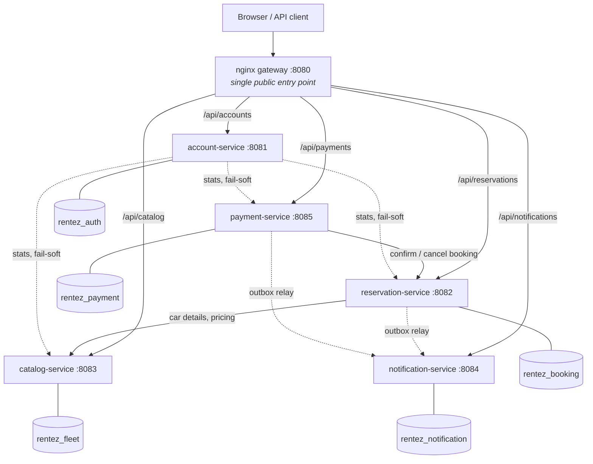

# RentEZ

A car rental platform built as five independently deployable Spring Boot services behind an API gateway.

Customers browse a fleet, check availability for a date range, book a car, pay for it and get notified. Staff manage vehicles and maintenance. Admins manage accounts, issue refunds and read a dashboard. Underneath that ordinary-looking flow is the actual subject of this project: what it takes to split a domain across service boundaries without losing correctness.

Built for the NUS-ISS Advanced Software Architecture practice module.

---

## Contents

- [What problems this solves](#what-problems-this-solves)
- [Architecture](#architecture)
- [Quick start](#quick-start)
- [The services](#the-services)
- [Deployment](#deployment)
- [API surface](#api-surface)
- [Design decisions worth knowing](#design-decisions-worth-knowing)
- [Repository layout](#repository-layout)
- [Contributing](#contributing)
- [Where to go next](#where-to-go-next)

---

## What problems this solves

### The business problem

Car rental is deceptively hard because a car is a *physical* thing that exists once. Most of the difficulty comes from that single fact:

| Problem | How RentEZ answers it |
|---|---|
| **A car cannot be rented twice for the same day.** Two customers clicking "Book" at the same moment must not both succeed. | One row per car per rented day under a composite primary key. The database rejects the second booking; no application logic is trusted to get the race right. |
| **Money and inventory must agree.** A charged card with an unconfirmed booking is a support ticket; a confirmed booking with no payment is lost revenue. | Payment runs as a saga with idempotent endpoints and a reconciliation sweeper that finishes anything interrupted. |
| **A booking must stay readable forever.** Prices change and cars get retired, but last year's receipt still has to explain itself. | The car's make, model, type and daily rate are snapshotted onto the booking when it is made. |
| **Cars leave the fleet for maintenance** and must disappear from availability immediately. | Maintenance lives with the fleet and flips vehicle status in the same transaction. |
| **Customers need to know what happened**, and a notification failure must never fail a booking. | Notifications go through a transactional outbox, delivered off the request path. |

### The engineering problem

The interesting constraint is that these services own separate schemas and cannot see each other's tables. Every problem below comes from that, and this codebase is largely an argument about how to handle them:

- **No cross-service joins.** A booking cannot `JOIN` a user or a car. Data is either snapshotted at write time or fetched through the owning service's API — never read out of another schema. PostgreSQL grants enforce this: `make db-isolation` proves `auth_user` cannot read `rentez_booking`.
- **No distributed transactions.** Taking payment and confirming a booking are two systems. Correctness comes from idempotent operations plus compensation, not from a transaction manager.
- **Networks fail halfway.** Any call can succeed, fail, or *time out having actually worked*. Every write that crosses a service is safe to retry, and duplicates are absorbed by unique constraints rather than avoided by hope.
- **Cycles are fatal.** Two services that call each other cannot be built, tested or deployed independently. Availability search deliberately lives in reservation, not catalog, to keep the dependency one-directional.
- **Degrade, don't cascade.** A slow service must not take out the ones that depend on it. The admin dashboard drops sections and says so rather than failing or — worse — reporting a confident zero.

---

## Architecture



Solid arrows are synchronous calls on the request path. Dashed arrows are either background delivery or fail-soft reads that cannot break the caller.

**Nothing calls account-service at runtime.** Every service validates JWTs locally against a shared secret, so identity never becomes a bottleneck or a single point of failure. That is also what makes account-service a safe place to host the admin dashboard: a service with no inbound dependencies cannot create a cycle by fanning out.

One PostgreSQL instance hosts five schemas, each with its own role and no cross-schema grants — the same shape as production, where it is one RDS instance. Any service could be moved to its own database with a connection-string change and no schema change.

---

## Quick start

**Prerequisites:** Docker Desktop with **8 GB** allocated, JDK 21, Node 22, GNU Make.

```bash
make check                              # verify toolchain, create .env
SPRING_PROFILES_ACTIVE=seed make up     # start everything with demo data
```

Give it ~40 seconds, then:

```bash
make db-check          # all five services UP against their own schema
./scripts/smoke.sh     # 33 checks across the whole rental flow
```

Log in and book something:

```bash
TOKEN=$(curl -sS -X POST http://localhost:8080/api/accounts/auth/login \
  -H 'Content-Type: application/json' \
  -d '{"email":"customer@nusiss.edu","password":"Customer123!"}' \
  | python3 -c 'import json,sys;print(json.load(sys.stdin)["token"])')

curl -sS -X POST http://localhost:8080/api/reservations/bookings \
  -H 'Content-Type: application/json' -H "Authorization: Bearer $TOKEN" \
  -d '{"carId":1,"startDate":"2032-06-10","endDate":"2032-06-12"}'
```

Demo accounts (local only — they exist because the `seed` profile is active, which must never be enabled in a deployed environment):

| Email | Password | Role |
|---|---|---|
| `admin@nusiss.edu` | `Admin123!` | ADMIN |
| `staff@nusiss.edu` | `Staff123!` | STAFF |
| `customer@nusiss.edu` | `Customer123!` | CUSTOMER |

**Full walkthrough, including the failure-mode demos: [`docs/ch03.verifying-the-services.adoc`](docs/ch03.verifying-the-services.adoc).**

### Two ways to run

| | `make infra` | `make up` |
|---|---|---|
| In Docker | PostgreSQL, DynamoDB, Adminer, gateway | the above + all five services |
| Services run | from your IDE, against `localhost` | in containers |
| Restart after a change | under a second | ~40 s rebuild |
| Use for | day-to-day development | integration testing, demos |

Every datasource property defaults to `localhost`, and Compose overrides it with `DB_HOST=postgres`. One properties file, both modes, no Spring profiles to remember.

| Endpoint | URL |
|---|---|
| Gateway (use this) | http://localhost:8080 |
| Adminer | http://localhost:8090 |
| Frontend | http://localhost:3000 |

---

## The services

| Service | Port | Schema | Owns | Calls |
|---|---|---|---|---|
| **account** | 8081 | `rentez_auth` | Users, roles, authentication, JWT issuance, admin dashboard | catalog, reservation, payment *(dashboard only, fail-soft)* |
| **catalog** | 8083 | `rentez_fleet` | Vehicles, maintenance records | — **nothing** |
| **reservation** | 8082 | `rentez_booking` | Bookings, availability, the double-booking guarantee | catalog |
| **payment** | 8085 | `rentez_payment` | Payments, refunds, the payment saga | reservation |
| **notification** | 8084 | `rentez_notification` | Delivering and storing notifications | — **nothing** |

Catalog and notification have no outbound runtime dependencies at all, which means they can be built, tested and deployed entirely on their own.

**Tech:** Spring Boot 4.1.0 · Java 21 · PostgreSQL 16 · Flyway · Spring Security (OAuth2 resource server) · Testcontainers · nginx · Docker Compose.

In AWS the same five services run on EKS against RDS PostgreSQL — see [Deployment](#deployment).

---

## Deployment

The same five services run on AWS: EKS behind one ALB, RDS PostgreSQL, and the
React build on S3 behind CloudFront. CloudFront is the only public entry point —
it serves the app at `/` and proxies `/api/*` to the ALB, so there is no CORS
problem, no certificate to buy and no domain to register.

The infrastructure splits into two layers with different lifetimes:

| Layer | Contains | Cost | Created by |
|---|---|---|---|
| **Persistent** | VPC, CloudFront, S3, ECR, DynamoDB, SQS, SSM secrets, budgets | ~$0.80/month | `make aws-bootstrap` (once per account) |
| **Ephemeral** | EKS cluster, node group, ALB, RDS | ~$0.21/hour | `make aws-up` (daily) |

The ephemeral layer holds a **lease**. `make aws-up` writes a deadline to SSM and
a Lambda tears everything down when it passes, so a forgotten cluster cannot
become a $155 month.

```bash
make aws-status      # what is running, burn rate, who has it, time left
make aws-up          # ~20 min, 4-hour lease
make aws-deploy      # ~3 min, redeploy code only — no infrastructure
make aws-down        # dump to S3, then destroy everything billed by the hour
```

`make aws-up` provisions; `make aws-deploy` deploys. That split is why a code
change redeploys in three minutes instead of twenty, and why CI can deploy by
running the same script rather than a reimplementation in YAML.

| Document | What's in it |
|---|---|
| [`docs/architecture.md`](docs/architecture.md) | The AWS topology, cost layers, and why each piece is shaped that way |
| [`docs/cicd-pipeline.md`](docs/cicd-pipeline.md) | The four workflows, five stages, and what a deploy actually does |
| [`docs/aws-team-setup.md`](docs/aws-team-setup.md) | SOP for giving teammates access to the shared account |
| [`aws/README.md`](aws/README.md) | Operational detail: teardown, backups, troubleshooting |

---

## API surface

Everything goes through the gateway on `:8080`. Service ports are published for debugging only — using them directly bypasses the gateway and proves nothing about routing.

### Public — no token needed

```
POST   /api/accounts/auth/register
POST   /api/accounts/auth/login
GET    /api/catalog/cars                      ?location=&type=
GET    /api/catalog/cars/{id}
GET    /api/reservations/availability         ?location=&type=&startDate=&endDate=
```

### Customer

```
GET    /api/accounts/users/me
PUT    /api/accounts/users/me
POST   /api/reservations/bookings
GET    /api/reservations/bookings/me
GET    /api/reservations/bookings/{id}
PUT    /api/reservations/bookings/{id}
DELETE /api/reservations/bookings/{id}
POST   /api/payments                          Idempotency-Key: <key>
GET    /api/payments/me
GET    /api/notifications/me
GET    /api/notifications/me/unread-count
PUT    /api/notifications/{id}/read
```

### Staff and admin

```
POST   /api/catalog/cars                              ADMIN
PUT    /api/catalog/cars/{id}                         ADMIN
DELETE /api/catalog/cars/{id}                         ADMIN
PATCH  /api/catalog/cars/{id}/status                  ADMIN, STAFF
POST   /api/catalog/maintenance                       ADMIN
PUT    /api/catalog/maintenance/{id}/status           ADMIN, STAFF
GET    /api/catalog/maintenance/car/{carId}           ADMIN, STAFF
POST   /api/payments/{id}/refund                      ADMIN
GET    /api/payments?bookingId=                       ADMIN, STAFF
GET    /api/accounts/admin/users                      ADMIN
PUT    /api/accounts/admin/users/{id}/status          ADMIN
PUT    /api/accounts/admin/users/{id}/role            ADMIN
GET    /api/accounts/admin/reports/summary            ADMIN
GET    /api/{service}/admin/audit-log                 ADMIN
```

### Internal — service-to-service only

`/api/*/internal/**` is refused at the gateway *and* requires a `SERVICE`-role token. Both layers matter: Compose publishes ports 8081–8085 on the host, so anything running locally could otherwise skip the gateway entirely.

---

## Design decisions worth knowing

Read these before changing anything structural. Each one exists because the alternative was tried or seriously considered.

**Availability search lives in reservation, not catalog.** It needs booking data. Putting it in catalog would mean catalog calling reservation while reservation already calls catalog — a cycle in which neither service could be deployed alone. The cost is that one endpoint moved; the benefit is that catalog has zero outbound dependencies.

**Bookings snapshot the car.** `car_make`, `car_model`, `car_type` and `daily_rate_snapshot` are copied onto the booking at creation. This is not denormalisation for performance — it removes two cross-service reads outright (composing a notification message, and grouping the report by car type) and lets a booking survive the car being repriced or deleted.

**Double-booking is prevented by a primary key, not by a check.** `booking_day` holds one row per car per rented day under `(car_id, day)`. Checking availability and then inserting leaves a window between the two; a unique index does not. `ConcurrentBookingTest` races eight threads for one car and asserts exactly one wins.

**Notifications go through a transactional outbox.** The business change and its pending event commit together; a relay delivers afterwards, at-least-once, and the consumer de-duplicates on `event_id`. A notification outage therefore cannot fail a booking. The transport is HTTP today — swapping in a broker replaces the relay's sink and nothing else.

**Payments are written before the gateway is called.** The row is inserted as `INITIATED`, then updated with the outcome. Saving only after the provider answers leaves a window where money moves with nothing recorded.

**Two database-level guarantees on payments.** `idempotency_key` is unique, so a retried request returns the original payment. Separately, a stored generated column makes `succeeded_booking_id` non-null only for successful payments and puts a unique index on it — NULLs don't collide, so any number of declined attempts are fine while a second *successful* payment for one booking is refused by the database.

**Authorization comes from the token, not the database.** `role` and `userId` are JWT claims, so no service queries account-service to find out who is calling. The trade is that authorization is only as fresh as the token, which is why tokens expire in **15 minutes**.

**The admin dashboard degrades and says so.** Missing sections are `null` with `"partial": true`, never zero. `"totalRevenue": 0` reads as a business fact rather than "payment-service is down".

---

## Repository layout

```
services/            the five Spring Boot services
  */src/main/java/org/rentez/<name>service/
    domain/          entities and enums
    repository/      Spring Data repositories
    service/         business logic
    web/             controllers
    web/dto/         request and response records — entities are never returned
    client/          typed clients for other services
    security/        SecurityConfig, JWT
    error/           ApiException, GlobalExceptionHandler
  */src/main/resources/db/migration/   Flyway migrations
frontend/            React + Vite + React Router — pages, components, styles
db/init/             schema and role provisioning, runs once on first boot
scripts/             gateway.conf, init-dynamodb.sh, smoke.sh
deploy/
  helm/rentez-service/   one chart, installed five times
  helm/values/           per-service values (path, DB role, HPA range)
  k8s/                   internal-path deny rule
aws/
  cloudformation/    guardrails, persistent layer, database
  eksctl/            cluster definition
  scripts/           aws-up, aws-deploy, aws-down, aws-status, ...
  iam/               CI deploy policy
docs/                architecture chapters + operations references
```

Each service is a standalone Maven project with its own wrapper. There is deliberately **no shared library** and no parent POM: every service's Docker build context is its own directory and runs `mvn dependency:go-offline` against Maven Central, so a sibling `org.rentez` artifact would be invisible to the image build. A small amount of duplication buys independent buildability.

---

## Contributing

### Getting set up

```bash
git clone <repo> && cd NUS-ISS-ASS-Practice-Module
make check
SPRING_PROFILES_ACTIVE=seed make up
./scripts/smoke.sh          # if this passes, your environment is good
```

### Branching

Three branch types: `main` is production, `dev` is integration, `feature/**` is where work happens. Branch from `dev`, PR back into `dev`, and release by PR from `dev` into `main`.

`.github/workflows/sync-main.yml` automatically opens sync PRs from `main` into every open feature branch **with auto-merge enabled**, so your branch stays current without you doing anything — and changes on `main` land in your branch without warning. Worth knowing before you wonder where a commit came from.

Full detail: [`docs/branching-strategy.md`](docs/branching-strategy.md).

### Before you open a PR

```bash
cd services/<service> && ./mvnw verify    # your service's tests
make test-backend                         # all 70 tests, if you touched shared shapes
./scripts/smoke.sh                        # if you changed an endpoint or the gateway
```

`Rentez CI` runs four jobs on every push to `main`, `dev` and `feature/**`: `frontend` (Node 22), `backend` (a matrix over all five services on Java 21), `sast` (CodeQL) and `dependency-check` (OWASP). On success, merges to `dev` or `main` trigger a deploy — see [`docs/cicd-pipeline.md`](docs/cicd-pipeline.md).

`.github/CODEOWNERS` assigns reviewers automatically — services and frontend to `@sayoungestguy`, infrastructure and workflows to `@Uygnis`.

### Conventions that are not negotiable

These are the ones where breaking them fails quietly rather than loudly:

1. **Flyway owns the schema.** `ddl-auto=validate`, never `update`. Never edit a migration that has been applied — write a new `V<n>__*.sql`.
2. **No foreign keys across schemas.** Within a schema they are mandatory. Across one, store a plain identifier with no `REFERENCES`. If you want a cross-schema FK, the service boundary is probably drawn in the wrong place.
3. **Never return an entity from a controller.** Always a DTO. This is not style — the original codebase serialised every BCrypt password hash into API responses by returning entities directly.
4. **`@EnableMethodSecurity` must stay on `SecurityConfig`.** Without it, every `@PreAuthorize` silently becomes a no-op and admin endpoints open up to any authenticated user.
5. **Cross-service writes must be idempotent.** Callers retry on timeout. If calling twice is not the same as calling once, it is a bug.
6. **Write outbox events in the same transaction as the business change.** An outbox row written outside it is just another non-atomic write.
7. **Seed data is not a migration.** Migrations define structure; seed data is throwaway demo content behind `@Profile("seed")`.
8. **Cap the connection pool at 5.** Ten pods at Hikari's default of 10 would exhaust a `db.t4g.micro` exactly when autoscaling kicks in.

### Testing

Tests run against a **real PostgreSQL 16 container** via Testcontainers — not H2. H2 diverges from PostgreSQL on reserved words and JSON handling, and this project has already been bitten by it (`car.model_year` exists because `year` is reserved in H2). It is also the only place Flyway migrations execute and Hibernate validates entities against them.

Two things to know when writing tests:

- `src/test/resources/application.properties` **shadows** the main one rather than merging. If you add a `@Value` to main config, add it to the test file too or the context will not build.
- Background jobs (outbox relay, reconciliation sweeper) are disabled under test and driven explicitly. A timer firing mid-assertion turns a test into a race.

### Adding a new service

1. Copy an existing service directory; rename the artifact and package.
2. Add its schema and user to `db/init/01-schemas.sql`, and its password to `.env.example`.
3. Add a Compose block, a gateway `location`, an entry in the Makefile's `SERVICES` and `TARGETS`, a CI matrix entry, and a CODEOWNERS rule.
4. Add `V1__init.sql`, a `TestcontainersConfiguration`, and a `SecurityConfig` — remembering `@EnableMethodSecurity`.

`payment-service` was added this way and is the reference example.

### Known gaps — good places to start

| Area | What's needed |
|---|---|
| **ULID public identifiers** | `docs/ch02` specifies a `public_id` on every business entity so customers cannot enumerate bookings by incrementing a URL. Currently `BIGINT` ids are exposed. |
| **DynamoDB** | `rentez-sessions`, `rentez-availability` and `rentez-audit` are provisioned but unused. Sessions would enable real token revocation; today a disabled account keeps access until its token expires. |
| **Refresh tokens** | 15-minute expiry with no refresh means re-login. |
| **Messaging** | The outbox is broker-ready but delivers over HTTP. Swapping in SQS touches the relay's sink only. |
| **Stranded payments** | `INITIATED` rows are not swept automatically — resolving one means asking the provider what happened, which the mock gateway cannot answer. |
| **CloudFront masks API 404s** | The distribution rewrites 403/404 to `/index.html` with status 200 for React deep-linking, and that applies to `/api/*` too. A missing record returns HTML with a 200, so `res.ok` is true and JSON parsing then fails. Needs a CloudFront Function or an `/api/*`-scoped behaviour. |

---

## Where to go next

**Building and running locally**

| Document | What's in it |
|---|---|
| [`docs/ch01.startup-project.adoc`](docs/ch01.startup-project.adoc) | Development modes, ports, configuration, testing strategy, day-one conventions |
| [`docs/ch02.database-schema.adoc`](docs/ch02.database-schema.adoc) | The full target schema — 30+ tables, conventions for money, time, soft deletes and identifiers |
| [`docs/ch03.verifying-the-services.adoc`](docs/ch03.verifying-the-services.adoc) | Running it, verifying it, and demonstrating the failure modes |

**Architecture and operations**

| Document | What's in it |
|---|---|
| [`docs/architecture.md`](docs/architecture.md) | AWS topology, request path, persistent vs ephemeral layers |
| [`docs/branching-strategy.md`](docs/branching-strategy.md) | Branch types, rules, lifecycle, automatic sync |
| [`docs/cicd-pipeline.md`](docs/cicd-pipeline.md) | Workflows, stages, design decisions, expected failures |
| [`docs/aws-team-setup.md`](docs/aws-team-setup.md) | SOP for shared-account access, daily commands, troubleshooting |
| [`aws/README.md`](aws/README.md) | Cost model, teardown, backups, things that will bite |

Useful commands:

```bash
make help          # every target with a description
make ps            # container status and health
make logs S=<svc>  # follow one service
make db-isolation  # prove schema isolation ("Access denied" is the pass)
make down          # stop, keep data
make clean         # stop and delete volumes
```
