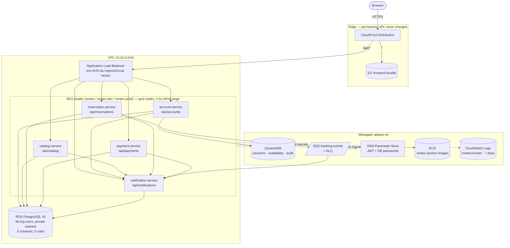
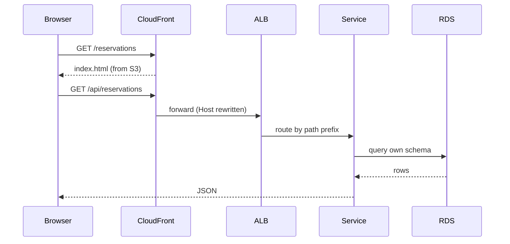
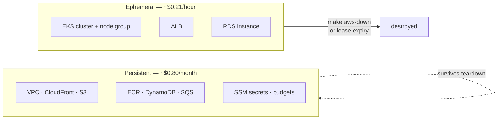

# RentEZ — Application Architecture

> Related: [Branching Strategy](branching-strategy.md) · [CI/CD Pipeline](cicd-pipeline.md) · [AWS Team Setup](aws-team-setup.md)

Five Spring Boot services and a React frontend. One CloudFront distribution is
the only public entry point: it serves the React build from S3 at `/` and
proxies `/api/*` to a single ALB in front of EKS.

This describes **one** environment. The shared account runs two of them — `dev`
and `prod` — each with its own cluster, namespace, CloudFront distribution and
URL, sharing the VPC, the ECR repositories and the RDS *instance* underneath.
See [Two environments in one account](aws-team-setup.md#two-environments-in-one-account).



## Services

| Service | Public path | DB role | Replicas (HPA) |
|---|---|---|---|
| account-service | `/api/accounts` | `auth_user` | 2–4 |
| catalog-service | `/api/catalog` | `fleet_user` | 2–6 |
| reservation-service | `/api/reservations` | `booking_user` | 2–10 |
| payment-service | `/api/payments` | `payment_user` | 2–4 |
| notification-service | `/api/notifications` | `notification_user` | 1 (no HPA) |

Each service owns its own PostgreSQL schema and connects with its own role. No
service reads another's tables — cross-service data goes over HTTP or SQS.

**notification-service is public, and was not always.** Its Helm values used to
disable the ingress on the grounds that it "has no public API", which was
untrue: `NotificationController` serves `/api/notifications/me` and
`/me/unread-count`, and the frontend's notifications page calls both. With no
ALB rule for that path, CloudFront fell through to the SPA and returned
`index.html` with a `200` — a status code that passes any check and a body that
parses as garbage. The ingress now sits at `group.order 104`, after the other
four.

It is the one service with **no HPA**. It is a queue consumer, and CPU is the
wrong signal for one: a consumer falling behind is blocked, not busy, so
utilisation stays low however deep the backlog gets. An HPA there would draw a
healthy-looking dashboard over a growing backlog. Scaling it properly means KEDA
on queue depth, which is out of scope.

## Request path



## Key decisions

- **One ALB, not five.** All five Ingresses join IngressGroup `rentez`, so one
  load balancer serves everything (~$0.0225/hr instead of five).
- **No NAT gateway.** Nodes sit in public subnets with security groups. A NAT
  gateway would cost ~$43/month whether or not traffic flows.
- **Spot nodes.** ~70% cheaper. Every workload is stateless behind a load
  balancer; the database is RDS, so an interrupted node loses nothing.
- **CloudFront is permanent, everything else is disposable.** The team URL never
  changes; only the `/api/*` origin is rewritten when the ALB is recreated.
- **Same origin for app and API.** No CORS, no mixed content, no ACM certificate
  to buy, and no API base URL compiled into the frontend.
- **`/internal/*` paths are blocked at the ALB** by a deny rule at
  `group.order 10`, so service-to-service endpoints are never publicly routable.

## Logs outlive the cluster

`kubectl logs` reaches a live pod on a live cluster. This environment is torn
down every few hours onto spot nodes, so the logs from the run that actually
failed were routinely gone before anyone looked at them.

`make aws-up` installs **Fluent Bit** (`eks/aws-for-fluent-bit`, not `fluent/` —
only the AWS build carries the CloudWatch output plugin) with an IRSA service
account scoped to `/rentez/*` and nothing else. Every container's stdout lands
in one log group:

```bash
aws logs tail /rentez/cluster --follow --filter-pattern account-service
```

One group, not one per service: `cloudwatch_logs` has a `log_group_template`,
but its record accessor rejects a literal prefix before an accessor. The stream
name carries the pod, namespace and container, so filtering does the same job.

Retention is capped at **7 days** (`LOG_RETENTION_DAYS`). CloudWatch keeps
events forever by default and bills for the storage indefinitely, including for
clusters destroyed months ago — a charge nobody goes looking for.

Fluent Bit tails from the *end* of each container log, so nothing written before
it started is captured, and Spring Boot logs no line at all for a successful
request. A quiet service is not necessarily a broken one.

## Two layers, two lifetimes



| Layer | Contains | Cost | Created by |
|---|---|---|---|
| **Persistent** | VPC, CloudFront, S3, ECR, DynamoDB, SQS, SSM, budgets | ~$0.80/month | `make aws-bootstrap` (account stack once per account; environment stack once per environment) |
| **Ephemeral** | EKS cluster, node group, ALB, RDS | ~$0.21/hour | `make aws-up` (daily) |

The ephemeral layer holds a **lease**: `make aws-up` writes a deadline to SSM at
`/rentez/env/expires-at`, and a Lambda checks it every five minutes and tears
everything down when it passes. This is what stops a forgotten cluster becoming
a $155 month.

## SPA routing at the edge

React deep-linking needs `/bookings/42` to serve `index.html`, because that path
is not an S3 object and S3 answers `403` for it through OAC. A **CloudFront
Function on the default cache behaviour** rewrites extensionless paths to
`/index.html` before the request reaches S3.

This was previously done with `CustomErrorResponses` mapping 403 and 404 to
`200 /index.html`, which was listed here as a known issue: that setting is
distribution-level, so it applied to `/api/*` as well and every API 403 and 404
reached the browser as `200 text/html`. A `fetch()` checking `res.ok` saw
success and then failed parsing HTML as JSON. Because `/api/*` has its own cache
behaviour and no function association, the function cannot repeat that mistake —
API responses keep their real status codes.
