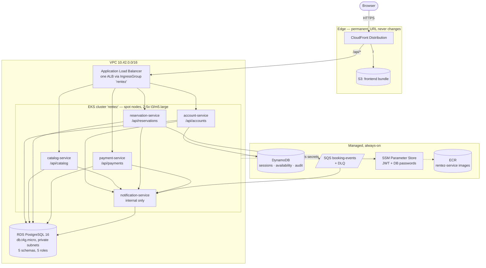
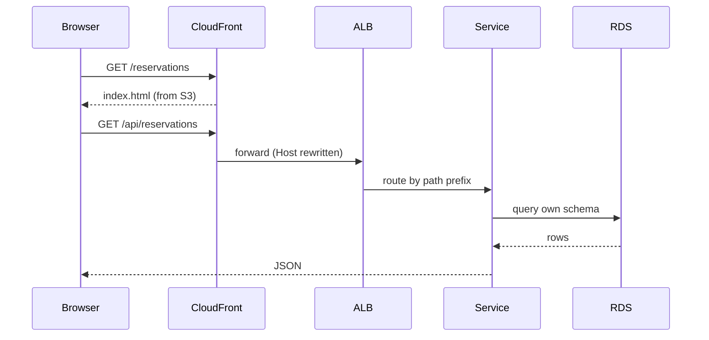
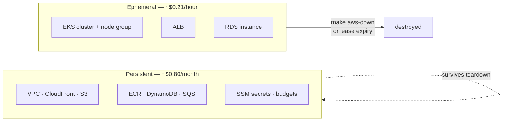

# RentEZ — Application Architecture

> Related: [Branching Strategy](branching-strategy.md) · [CI/CD Pipeline](cicd-pipeline.md) · [AWS Team Setup](aws-team-setup.md)

Five Spring Boot services and a React frontend. One CloudFront distribution is
the only public entry point: it serves the React build from S3 at `/` and
proxies `/api/*` to a single ALB in front of EKS.

## Services

| Service | Public path | DB role | Replicas (HPA) |
|---|---|---|---|
| account-service | `/api/accounts` | `auth_user` | 2–4 |
| catalog-service | `/api/catalog` | `fleet_user` | 2–6 |
| reservation-service | `/api/reservations` | `booking_user` | 2–10 |
| payment-service | `/api/payments` | `payment_user` | 2–4 |
| notification-service | *(none — internal)* | `notification_user` | 1 |

Each service owns its own PostgreSQL schema and connects with its own role. No
service reads another's tables — cross-service data goes over HTTP or SQS.

## Request path

## Key decisions

- **One ALB, not five.** All five Ingresses join IngressGroup `rentez`, so one
  load balancer serves everything (~$0.0225/hr instead of five).
- **No NAT gateway.** Nodes sit in public subnets with security groups. A NAT
  gateway would cost ~$43/month whether or not traffic flows.
- **Spot nodes.** ~70% cheaper. Every workload is stateless behind a load
  balancer; the database is RDS, so an interrupted node loses nothing.
- **CloudFront is permanent, everything else is disposable.** The team URL never
  changes; only the `/api/*` origin is rewritten when the ALB is recreated.
- **Same origin for app and API.** No CORS, no mixed content, no ACM certificate
  to buy, and no API base URL compiled into the frontend.
- **`/internal/*` paths are blocked at the ALB** by a deny rule at
  `group.order 10`, so service-to-service endpoints are never publicly routable.

## Two layers, two lifetimes

| Layer | Contains | Cost | Created by |
|---|---|---|---|
| **Persistent** | VPC, CloudFront, S3, ECR, DynamoDB, SQS, SSM, budgets | ~$0.80/month | `make aws-bootstrap` (once per account) |
| **Ephemeral** | EKS cluster, node group, ALB, RDS | ~$0.21/hour | `make aws-up` (daily) |

The ephemeral layer holds a **lease**: `make aws-up` writes a deadline to SSM at
`/rentez/env/expires-at`, and a Lambda checks it every five minutes and tears
everything down when it passes. This is what stops a forgotten cluster becoming
a $155 month.

## Known issue

CloudFront maps **403 and 404 to `/index.html` with status 200** for React
deep-linking, and that applies to `/api/*` too. A missing record therefore
returns `200` with an HTML body, so a `fetch()` checking `res.ok` sees success
and then fails parsing HTML as JSON. Fixing it needs a CloudFront Function or an
`/api/*`-scoped behaviour that skips the error rewrite.
