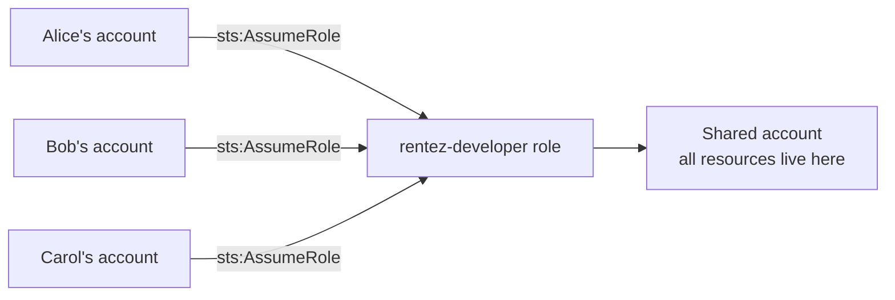
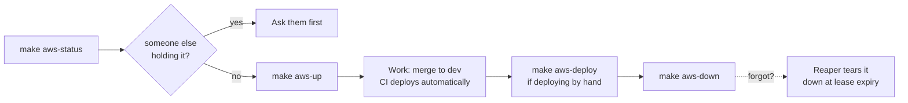

# RentEZ — AWS Team Setup (SOP)

> Related: [Architecture](architecture.md) · [Branching Strategy](branching-strategy.md) · [CI/CD Pipeline](cicd-pipeline.md)

Everyone keeps their own AWS account. The environment lives in **one shared
account**. Members assume a role in it, so there are no shared credentials and
nothing to rotate.



---

## Part 1 — One-time, by the account owner

### Step 1: Create the role

In the shared account, create role `rentez-developer` with this trust policy,
listing each member's account ID:

```json
{
  "Version": "2012-10-17",
  "Statement": [{
    "Effect": "Allow",
    "Principal": { "AWS": [
      "arn:aws:iam::<alice-account-id>:root",
      "arn:aws:iam::<bob-account-id>:root"
    ]},
    "Action": "sts:AssumeRole",
    "Condition": { "Bool": { "aws:MultiFactorAuthPresent": "true" } }
  }]
}
```

Trusting `:root` delegates to each member's account the decision of which of
their users may assume it — add a teammate once here, and they manage their own
users.

### Step 2: Attach permissions

`eksctl` creates IAM roles, CloudFormation stacks, VPC resources, EKS and RDS.
Attach `PowerUserAccess` + `IAMFullAccess`.

Scoping this tightly is a hard exercise with little payoff. The real cost
controls are the budget guardrails and the 4-hour reaper, not narrow IAM.

### Step 3: Bootstrap the account

```bash
make aws-bootstrap NOTIFY_EMAIL=you@u.nus.edu
```

Creates only free things: budgets, secrets, VPC, ECR repositories, S3 buckets,
CloudFront, DynamoDB, SQS, and the reaper Lambda. Prints the permanent URL —
bookmark it, it survives every teardown.

Run this **once per account**, ever.

---

## Part 2 — One-time, by each member

### Step 1: Allow the assume

In your **own** account, attach this to your IAM user:

```json
{
  "Effect": "Allow",
  "Action": "sts:AssumeRole",
  "Resource": "arn:aws:iam::<shared-account-id>:role/rentez-developer"
}
```

### Step 2: Add a CLI profile

In `~/.aws/config`:

```ini
[profile rentez]
role_arn          = arn:aws:iam::<shared-account-id>:role/rentez-developer
source_profile    = default
role_session_name = alice
region            = ap-southeast-1
mfa_serial        = arn:aws:iam::<your-account-id>:mfa/alice
```

> **Set `role_session_name` to your own name.** The scripts read the last
> segment of your caller ARN, so this makes `aws-status` say *"held by alice"*,
> tags resources with your name for per-person cost tracking in Cost Explorer,
> and warns teammates before they tear down your cluster. Leave it unset and
> everyone looks identical, which is worse than useless because it still looks
> meaningful.

### Step 3: Install the tools

```bash
brew install awscli eksctl kubectl helm gettext node git
```

**Windows users: use WSL2 (Ubuntu)** with Docker Desktop's WSL2 integration.
Keep the repo inside the WSL filesystem (`~/code/...`), not `/mnt/c/` — cross
filesystem I/O makes Maven builds several times slower.

The scripts are bash and need `envsubst`, `mktemp` and GNU make. `cmd.exe` and
PowerShell will not work. Git Bash mostly works but lacks `envsubst` and mangles
the `/rentez/...` SSM parameter names into Windows paths — not worth the trouble.

### Step 4: Verify

```bash
export AWS_PROFILE=rentez
make aws-check
```

Checks every tool, your credentials, and the state of the shared account.

---

## Part 3 — Daily use

```bash
export AWS_PROFILE=rentez

make aws-status                 # what is running, cost, who has it, time left
make aws-up                     # ~20 min, 4-hour lease, ~$0.21/hr
make aws-deploy                 # ~3 min, redeploy code only
make aws-extend HOURS=4         # push the lease out
make aws-down                   # dump to S3, then destroy hourly-billed things
```

Useful variants:

```bash
make aws-up TTL_HOURS=8         # longer lease for a demo day
make aws-up TAG=abc1234         # deploy a specific image tag
make aws-up RESTORE=0           # start from an empty database
make aws-down KEEP_DB=1         # keep RDS running (~$13/month) for tomorrow
```

`make aws-status` reports on the stacks the account **actually has**, not the
ones the current defaults name — an account bootstrapped before the stack split
used to read as "not bootstrapped" while its cluster was up and billing. An
`ACCOUNT_STACK` you set yourself is never quietly substituted, and the output
names the stack whenever it is not the one the labels imply.

`make aws-status` and `make aws-down` act on **one** environment — whichever
`CLUSTER_NAME` and stack names are in your shell. With `dev` and `prod` both up,
tearing down the one you were working in leaves the other running.

Reading logs does not need a cluster shell:

```bash
aws logs tail /rentez/cluster --follow --filter-pattern reservation-service
```

They are kept for 7 days. `kubectl logs` only reaches a pod that is still
alive, which on spot nodes with a 4-hour lease is usually not the one that
failed.

### Typical day



### Rules

1. **Run `make aws-status` before `make aws-up`.** If someone else holds the
   environment, bringing it up extends their lease and deploys over their work.
2. **Always use the role**, never a direct IAM user in the shared account. The
   cluster grants admin to its *creator*; if someone creates it as a plain IAM
   user, everyone else gets `Unauthorized` until it is rebuilt.
3. **`make aws-down` when you finish.** The reaper is a safety net, not a plan.
4. **One person brings it up per day.** Four people running `make aws-up` means
   paying for four control planes.

---

## Part 4 — Enabling the pipeline

Once the shared account is bootstrapped, wire up CI so merges deploy
automatically.

### Step 1: Create the OIDC provider

```bash
aws iam create-open-id-connect-provider \
  --url https://token.actions.githubusercontent.com \
  --client-id-list sts.amazonaws.com \
  --thumbprint-list 1c58a3a8518e8759bf075b76b750d4f2df264fcd
```

### Step 2: Create the CI role

The role needs two policies: a *trust* policy saying who may assume it, and a
*permissions* policy saying what it may then do. Both are in `aws/iam/`, and
`create-role` requires the first — it has no default, which is why this step
previously could not be completed from the repo alone.

Two placeholders have to be filled in first. `<ACCOUNT_ID>` is obvious;
`<SUB_CLAIM_PREFIX>` is not, and getting it wrong is the single most likely
reason a deploy fails with `Not authorized to perform
sts:AssumeRoleWithWebIdentity`. This repository uses immutable subject claims,
so the token's `sub` carries numeric IDs rather than names — ask GitHub for it:

```bash
gh api repos/Uygnis/NUS-ISS-ASS-Practice-Module/actions/oidc/customization/sub \
  --jq '.sub_claim_prefix'
# repo:Uygnis@75312898/NUS-ISS-ASS-Practice-Module@1313919272
```

```bash
aws iam create-role --role-name rentez-ci-deploy \
  --assume-role-policy-document file://aws/iam/ci-trust-policy.json

aws iam put-role-policy --role-name rentez-ci-deploy \
  --policy-name rentez-deploy \
  --policy-document file://aws/iam/ci-deploy-policy.json
```

The trust policy admits any run from this repository. That is deliberate — the
account is shared, so anyone on the team can press the deploy button without an
AWS account of their own. It also means repository write access is effectively
deploy access to this account.

This role is cluster-admin on EKS, which is why the policy is scoped statement
by statement rather than using `AdministratorAccess`.

### Step 3: Set repository variables

Settings → Secrets and variables → Actions → **Variables** (not secrets — none
of these are sensitive, and there are deliberately no long-lived AWS keys):

| Variable | Value |
|---|---|
| `AWS_DEPLOY_ROLE_ARN` | the role from Step 2 |
| `AWS_REGION` | `ap-southeast-1` |

Repository-wide, because the account is shared: every deploy assumes the same
role regardless of who triggered it.

### Step 3b: One GitHub Environment per deployment target

Settings → **Environments**. The Environment does not choose an account — there
is only one — it chooses *where inside it* a run deploys, so that a merge to
`dev` and a merge to `main` stop landing on top of each other. `dev.yml` and
`prod.yml` pass `dev` and `prod` automatically; typing a name into Run workflow
picks one by hand.

| Variable | `dev` | `prod` |
|---|---|---|
| `CLUSTER_NAME` | `rentez-dev` | `rentez-prod` |
| `NAMESPACE` | `rentez-dev` | `rentez-prod` |
| `ENVIRONMENT_STACK` | `rentez-environment-dev` | `rentez-environment-prod` |
| `ENVIRONMENT_NAME` | `dev` | `prod` |
| `DB_NAME` | `rentez_dev` | `rentez_prod` |

`ACCOUNT_STACK` stays unset — one per account, shared by every environment.

Each of these defaults in `aws/scripts/lib.sh`, so an Environment that sets none
of them deploys to the original single `rentez` environment and nothing changes.

See "Two environments in one account" below for what each environment gets of
its own, and what it shares.

### Step 4: Grant the role cluster access

**IAM permission is not cluster permission.** `eksctl` grants admin only to the
principal that created the cluster, so the pipeline needs an EKS *access entry*
as well. `make aws-up` creates one when told the role ARN:

```bash
export CI_ROLE_ARN=arn:aws:iam::<shared-account-id>:role/rentez-ci-deploy
CLUSTER_NAME=rentez-dev NAMESPACE=rentez-dev \
  ENVIRONMENT_STACK=rentez-environment-dev ENVIRONMENT_NAME=dev \
  DB_NAME=rentez_dev \
  make aws-up
```

Once per cluster — two environments means running this twice, each with its own
names.

### Two environments in one account

Each environment gets its own frontend bucket, CloudFront distribution, URL,
DynamoDB tables and SQS queues, from its own `15-environment.yaml` stack. What
it shares, through the single `10-account.yaml` stack, is the VPC and subnets,
the security groups and the five ECR repositories — none of which benefit from
duplication, and the shared VPC is what lets a second cluster cost no second
NAT gateway.

The database is shared at the *instance* level and separate at the *database*
level: `DB_NAME` gives each environment its own database inside the one RDS
instance, with the five per-service schemas created in each by `make aws-up`. A
second instance would be a second hourly bill for isolation the database
already provides.

`10-persistent.yaml` stays in the tree because the account bootstrapped before
the split still runs on it. It needs no migration: that one stack publishes all
twelve outputs the two new ones publish between them, so setting
`ACCOUNT_STACK=rentez-persistent ENVIRONMENT_STACK=rentez-persistent` adopts the
existing environment unchanged, URL included. `make aws-bootstrap` refuses to
run without that when it finds a legacy stack, rather than building a second VPC
and then failing on bucket names that already exist. See "Adopting an account
bootstrapped before the split" in `aws/README.md`.

**Subnet tags, since this is easy to get wrong later.** The shared subnets carry
`kubernetes.io/role/elb` and deliberately *no* `kubernetes.io/cluster/<name>`
tag. The AWS Load Balancer Controller's rule is that if any cluster tag exists
on a subnet but none names the cluster doing the lookup, the subnet is filtered
out — so tagging these for one cluster would hide them from every other cluster
in the account, and the ingress would fail with "unable to discover subnets".
With no such tag the rule never fires and the role tag alone serves any number
of clusters. Do not add one back per cluster.

## Troubleshooting

| Symptom | Cause |
|---|---|
| `You must be logged in to the server (Unauthorized)` | Missing EKS access entry — see Part 4, Step 4 |
| `no cluster 'rentez-dev'` from a deploy run | Nobody has run `make aws-up` for that environment. Expected outside working sessions. |
| `kubectl get hpa` shows `<unknown>` CPU | metrics-server not running; HPAs cannot scale |
| `exec format error` in a pod | An arm64 image on x86 nodes — build with `--platform linux/amd64` |
| `no image tagged 'x' in ECR` | Deploying a tag that was never built. Merge to `dev`, or `make aws-images`. |
| `$'\r': command not found` | CRLF line endings — `.gitattributes` should prevent this; re-clone |
| An API call returns `200` with `index.html` in the body | That path has no ALB rule, so CloudFront fell through to the SPA. Check the service's `ingress.enabled` in `deploy/helm/values/`. |
| `make aws-status` says "not bootstrapped" while things are running | Fixed — update your checkout. It read the post-split stack names against a pre-split account. |

Two more places to look before guessing: `aws logs tail /rentez/cluster` for
what the services said, and `./scripts/smoke.sh` against the environment URL for
whether the booking flow works end to end. The smoke test is safe to run
repeatedly against a deployed environment — it picks its car from the
availability response and moves its booking window per run, rather than booking
car 1 over a fixed window and then failing on its own leftovers.
