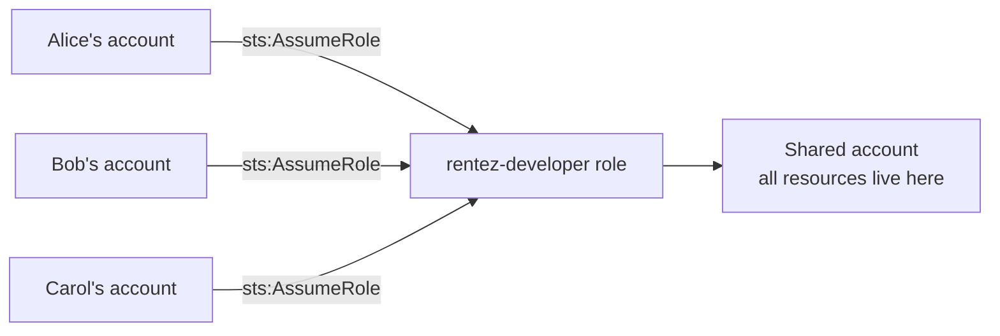
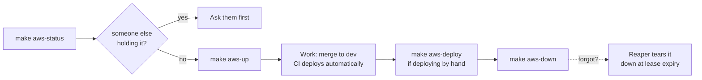

# RentEZ — AWS Team Setup (SOP)

> Related: [Architecture](architecture.md) · [Branching Strategy](branching-strategy.md) · [CI/CD Pipeline](cicd-pipeline.md)

Everyone keeps their own AWS account. The environment lives in **one shared
account**. Members assume a role in it, so there are no shared credentials and
nothing to rotate.



---

## Part 1 — One-time, by the account owner

### Step 1: Create the role

In the shared account, create role `rentez-developer` with this trust policy,
listing each member's account ID:

```json
{
  "Version": "2012-10-17",
  "Statement": [{
    "Effect": "Allow",
    "Principal": { "AWS": [
      "arn:aws:iam::<alice-account-id>:root",
      "arn:aws:iam::<bob-account-id>:root"
    ]},
    "Action": "sts:AssumeRole",
    "Condition": { "Bool": { "aws:MultiFactorAuthPresent": "true" } }
  }]
}
```

Trusting `:root` delegates to each member's account the decision of which of
their users may assume it — add a teammate once here, and they manage their own
users.

### Step 2: Attach permissions

`eksctl` creates IAM roles, CloudFormation stacks, VPC resources, EKS and RDS.
Attach `PowerUserAccess` + `IAMFullAccess`.

Scoping this tightly is a hard exercise with little payoff. The real cost
controls are the budget guardrails and the 4-hour reaper, not narrow IAM.

### Step 3: Bootstrap the account

```bash
make aws-bootstrap NOTIFY_EMAIL=you@u.nus.edu
```

Creates only free things: budgets, secrets, VPC, ECR repositories, S3 buckets,
CloudFront, DynamoDB, SQS, and the reaper Lambda. Prints the permanent URL —
bookmark it, it survives every teardown.

Run this **once per account**, ever.

---

## Part 2 — One-time, by each member

### Step 1: Allow the assume

In your **own** account, attach this to your IAM user:

```json
{
  "Effect": "Allow",
  "Action": "sts:AssumeRole",
  "Resource": "arn:aws:iam::<shared-account-id>:role/rentez-developer"
}
```

### Step 2: Add a CLI profile

In `~/.aws/config`:

```ini
[profile rentez]
role_arn          = arn:aws:iam::<shared-account-id>:role/rentez-developer
source_profile    = default
role_session_name = alice
region            = ap-southeast-1
mfa_serial        = arn:aws:iam::<your-account-id>:mfa/alice
```

> **Set `role_session_name` to your own name.** The scripts read the last
> segment of your caller ARN, so this makes `aws-status` say *"held by alice"*,
> tags resources with your name for per-person cost tracking in Cost Explorer,
> and warns teammates before they tear down your cluster. Leave it unset and
> everyone looks identical, which is worse than useless because it still looks
> meaningful.

### Step 3: Install the tools

```bash
brew install awscli eksctl kubectl helm gettext node git
```

**Windows users: use WSL2 (Ubuntu)** with Docker Desktop's WSL2 integration.
Keep the repo inside the WSL filesystem (`~/code/...`), not `/mnt/c/` — cross
filesystem I/O makes Maven builds several times slower.

The scripts are bash and need `envsubst`, `mktemp` and GNU make. `cmd.exe` and
PowerShell will not work. Git Bash mostly works but lacks `envsubst` and mangles
the `/rentez/...` SSM parameter names into Windows paths — not worth the trouble.

### Step 4: Verify

```bash
export AWS_PROFILE=rentez
make aws-check
```

Checks every tool, your credentials, and the state of the shared account.

---

## Part 3 — Daily use

```bash
export AWS_PROFILE=rentez

make aws-status                 # what is running, cost, who has it, time left
make aws-up                     # ~20 min, 4-hour lease, ~$0.21/hr
make aws-deploy                 # ~3 min, redeploy code only
make aws-extend HOURS=4         # push the lease out
make aws-down                   # dump to S3, then destroy hourly-billed things
```

Useful variants:

```bash
make aws-up TTL_HOURS=8         # longer lease for a demo day
make aws-up TAG=abc1234         # deploy a specific image tag
make aws-up RESTORE=0           # start from an empty database
make aws-down KEEP_DB=1         # keep RDS running (~$13/month) for tomorrow
```

### Typical day



### Rules

1. **Run `make aws-status` before `make aws-up`.** If someone else holds the
   environment, bringing it up extends their lease and deploys over their work.
2. **Always use the role**, never a direct IAM user in the shared account. The
   cluster grants admin to its *creator*; if someone creates it as a plain IAM
   user, everyone else gets `Unauthorized` until it is rebuilt.
3. **`make aws-down` when you finish.** The reaper is a safety net, not a plan.
4. **One person brings it up per day.** Four people running `make aws-up` means
   paying for four control planes.

---

## Part 4 — Enabling the pipeline

Once the shared account is bootstrapped, wire up CI so merges deploy
automatically.

### Step 1: Create the OIDC provider

```bash
aws iam create-open-id-connect-provider \
  --url https://token.actions.githubusercontent.com \
  --client-id-list sts.amazonaws.com \
  --thumbprint-list 1c58a3a8518e8759bf075b76b750d4f2df264fcd
```

### Step 2: Create the CI role

Create role `rentez-ci-deploy` trusting **only this repository** through that
provider, then:

```bash
aws iam put-role-policy --role-name rentez-ci-deploy \
  --policy-name rentez-deploy \
  --policy-document file://aws/iam/ci-deploy-policy.json
```

This role is cluster-admin on EKS, which is why the policy is scoped statement
by statement rather than using `AdministratorAccess`.

### Step 3: Set repository variables

Settings → Secrets and variables → Actions → **Variables** (not secrets — none
of these are sensitive, and there are deliberately no long-lived AWS keys):

| Variable | Value |
|---|---|
| `AWS_DEPLOY_ROLE_ARN` | the role from Step 2 |
| `AWS_REGION` | `ap-southeast-1` |

### Step 4: Grant the role cluster access

**IAM permission is not cluster permission.** `eksctl` grants admin only to the
principal that created the cluster, so the pipeline needs an EKS *access entry*
as well. `make aws-up` creates one when told the role ARN:

```bash
export CI_ROLE_ARN=arn:aws:iam::<shared-account-id>:role/rentez-ci-deploy
make aws-up
```

This must be set **every time the cluster is created**, because the cluster is
ephemeral. Put the export in the shared account's shell profile and forget it.

Skip this and every deploy fails with:

```
error: You must be logged in to the server (Unauthorized)
```

which mentions neither IAM nor the missing access entry, and sends people
looking at the OIDC trust policy for an afternoon.

---

## Troubleshooting

| Symptom | Cause |
|---|---|
| `You must be logged in to the server (Unauthorized)` | Missing EKS access entry — see Part 4, Step 4 |
| `no cluster 'rentez'` from a deploy run | Nobody has run `make aws-up`. Expected outside working sessions. |
| `kubectl get hpa` shows `<unknown>` CPU | metrics-server not running; HPAs cannot scale |
| `exec format error` in a pod | An arm64 image on x86 nodes — build with `--platform linux/amd64` |
| `no image tagged 'x' in ECR` | Deploying a tag that was never built. Merge to `dev`, or `make aws-images`. |
| `$'\r': command not found` | CRLF line endings — `.gitattributes` should prevent this; re-clone |
