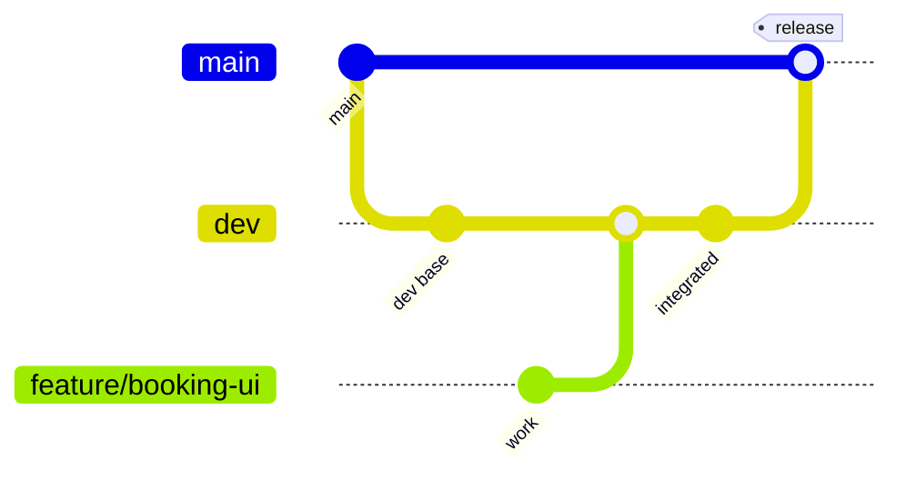
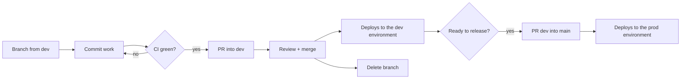

# RentEZ — Git Branching Strategy

> Related: [Architecture](architecture.md) · [CI/CD Pipeline](cicd-pipeline.md) · [AWS Team Setup](aws-team-setup.md)

Three branch types. `main` is production, `dev` is integration, `feature/**` is
where work happens.

## Branches

| Branch | Purpose | Protected | Deploys |
|---|---|---|---|
| `main` | Production. Always releasable. | Yes — PR + green CI | Yes → `prod` |
| `dev` | Integration. Where features land first. | Yes — PR + green CI | Yes → `dev` |
| `feature/**` | One branch per task. Short-lived. | No | No |

## Rules

1. **Branch from `dev`**, name it `feature/<short-description>`.
2. **PR into `dev`.** CI must pass. Never push directly to `dev` or `main`.
3. **`dev` → `main` by PR** when a set of features is ready to release.
4. **Delete the feature branch after merge.** Long-lived branches drift.

## Lifecycle

## Automatic sync

`.github/workflows/sync-main.yml` runs when a PR merges into `main`. It opens an
auto-merging PR from `main` into every open `feature/**` branch, skipping the
branch that was just merged, any branch already up to date, and any branch that
already has an open sync PR.

It runs on `secrets.GH_PAT`, not `GITHUB_TOKEN` — a PR opened by `GITHUB_TOKEN`
does not trigger workflows, so the sync PRs would never be tested. If the sync
stops happening, that secret has expired.

This keeps feature branches from drifting behind without anyone remembering to
rebase. If a sync PR has conflicts, resolve them on your feature branch — that
conflict was going to happen at merge time regardless, and it is cheaper now.

## CI coverage

`ci.yml` runs on push and PR to **`main`, `dev`, and `feature/**`**. Feature
branches are tested deliberately: that is when the feedback is worth most and
when a fix is cheapest.

## Two environments, one account

`dev` and `main` no longer land on top of each other. Each branch workflow names
a **GitHub Environment**, and that Environment names the cluster, namespace,
CloudFormation stack and database the run deploys to:

| Branch | Workflow | GitHub Environment | Cluster | Namespace | Database |
|---|---|---|---|---|---|
| `dev` | `dev.yml` | `dev` | `rentez-dev` | `rentez-dev` | `rentez_dev` |
| `main` | `prod.yml` | `prod` | `rentez-prod` | `rentez-prod` | `rentez_prod` |

Both live in the **same AWS account** and share the VPC, the security groups,
the five ECR repositories and the RDS *instance*. What each gets of its own is a
cluster, a database inside that instance, a frontend bucket, a CloudFront
distribution and therefore **its own URL** — so a demo off `main` is not
disturbed by a merge to `dev`.

Two consequences:

- **Each environment is a cluster, and a cluster is $0.10/hour.** Running both
  all day costs twice as much as running one. Bring up the one you need.
- A run deploys nothing at all if its Environment has no `AWS_DEPLOY_ROLE_ARN`.
  That is not a failure — the job summary says "Nothing was deployed" — and it
  is the normal state for anyone working from their own AWS account.

Every one of those names defaults in `aws/scripts/lib.sh`, so an Environment
that sets none of them deploys to the original single `rentez` environment and
nothing changes. Setup is in
[AWS Team Setup](aws-team-setup.md#step-3b-one-github-environment-per-deployment-target).
