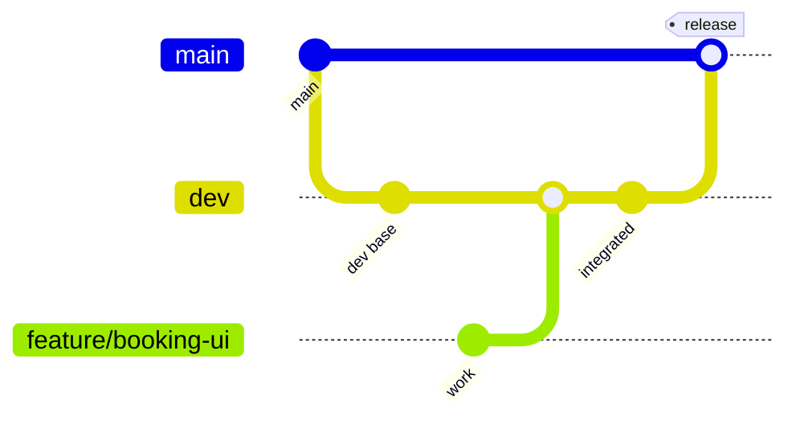
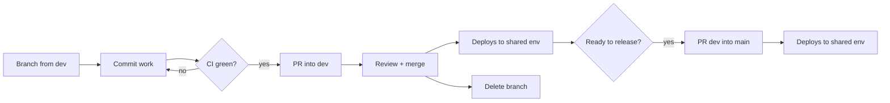

# RentEZ — Git Branching Strategy

> Related: [Architecture](architecture.md) · [CI/CD Pipeline](cicd-pipeline.md) · [AWS Team Setup](aws-team-setup.md)

Three branch types. `main` is production, `dev` is integration, `feature/**` is
where work happens.

## Branches

| Branch | Purpose | Protected | Deploys |
|---|---|---|---|
| `main` | Production. Always releasable. | Yes — PR + green CI | Yes |
| `dev` | Integration. Where features land first. | Yes — PR + green CI | Yes |
| `feature/**` | One branch per task. Short-lived. | No | No |

## Rules

1. **Branch from `dev`**, name it `feature/<short-description>`.
2. **PR into `dev`.** CI must pass. Never push directly to `dev` or `main`.
3. **`dev` → `main` by PR** when a set of features is ready to release.
4. **Delete the feature branch after merge.** Long-lived branches drift.

## Lifecycle

## Automatic sync

`.github/workflows/sync-main.yml` runs when a PR merges into `main`. It opens an
auto-merging PR from `main` into every open `feature/**` branch, skipping the
branch that was just merged and any branch already up to date.

This keeps feature branches from drifting behind without anyone remembering to
rebase. If a sync PR has conflicts, resolve them on your feature branch — that
conflict was going to happen at merge time regardless, and it is cheaper now.

## CI coverage

`ci.yml` runs on push and PR to **`main`, `dev`, and `feature/**`**. Feature
branches are tested deliberately: that is when the feedback is worth most and
when a fix is cheapest.

## One environment, not three

`dev` and `main` deploy to the **same** AWS environment. There is one cluster,
not a dev and a prod — the most recent deploy is what is live, regardless of
which branch produced it.

Two consequences:

- Check the workflow run summary to see which branch put the current build there.
- A merge to `dev` will overwrite what `main` deployed, and vice versa.
  Coordinate before demos.

If you need genuine isolation later, the options are separate namespaces in one
cluster (cheap, more moving parts) or a second AWS account (clean, doubles the
cost).
