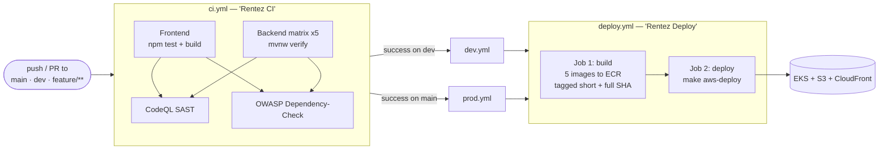
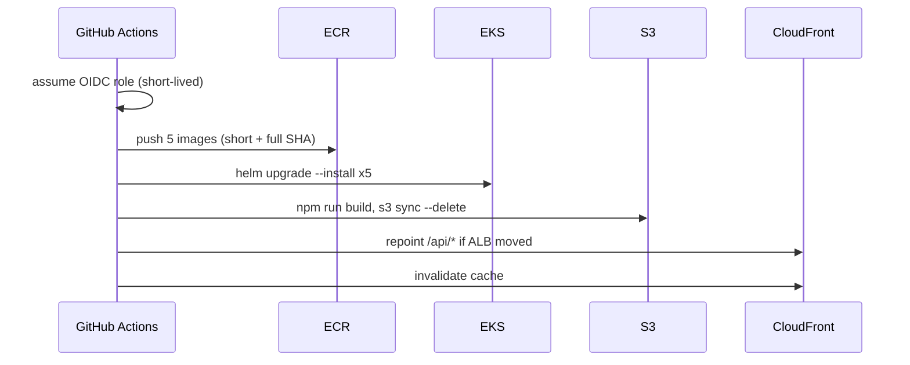

# RentEZ — CI/CD Pipeline Strategy

> Related: [Architecture](architecture.md) · [Branching Strategy](branching-strategy.md) · [AWS Team Setup](aws-team-setup.md)

Four workflows. CI tests everything; on success, a branch workflow calls the
shared deploy workflow.



## Workflows

| File | Name | Trigger | Does |
|---|---|---|---|
| `ci.yml` | Rentez CI | push/PR to `main`, `dev`, `feature/**` | Test, SAST, SCA |
| `dev.yml` | Deploy Dev | Rentez CI success on `dev` | Calls `deploy.yml` |
| `prod.yml` | Deploy Production | Rentez CI success on `main` | Calls `deploy.yml` |
| `deploy.yml` | Rentez Deploy | `workflow_call`, `workflow_dispatch` | Build to ECR, then deploy |
| `sync-main.yml` | Sync Main | PR merged to `main` | Auto-PR `main` into feature branches |

## Stages

| Stage | What | Blocking |
|---|---|---|
| **Test** | Frontend `npm test`, five services `./mvnw verify` (Testcontainers + Flyway) | Yes |
| **SAST** | CodeQL, `security-extended` queries, JS + Java | Yes |
| **SCA** | OWASP Dependency-Check, HTML report artifact | Yes |
| **Build** | 5 images → ECR as `rentez-<service>`, `linux/amd64`, GHA layer cache | Yes |
| **Deploy** | `make aws-deploy` — 5 Helm releases, frontend to S3, CloudFront | Yes |

## What a deploy actually does



## Design decisions

- **CI runs the same script a developer runs.** `deploy.yml` calls
  `make aws-deploy`, not a reimplementation in YAML. One description of what
  deploying means, reviewable as shell.
- **Deploy is chained off CI success**, never off a raw push. `workflow_run`
  fires on *completion*, so both callers explicitly check
  `conclusion == 'success'` — without that, a red CI run deploys anyway.
- **Build and deploy are separate from provisioning.** The pipeline never runs
  `make aws-up` — that creates hourly-billed resources and takes 20 minutes. A
  human decides when to spend money.
- **OIDC only, no static AWS keys.** Every leg touches AWS, so `GITHUB_TOKEN`
  has no role here. OIDC mints a short-lived credential per run with nothing to
  leak, rotate, or revoke when someone leaves.
- **Images tagged with both short and full SHA.** `make aws-deploy` defaults to
  the 7-char form, so a tag copied from a CI log always works either way.
- **`concurrency: deploy`, not per-ref, with `cancel-in-progress: false`.**
  `dev` and `main` share one cluster; two concurrent Helm rolls interleave and
  the loser wins. A half-applied deploy is worse than a slow one, so queue
  rather than cancel.
- **`linux/amd64` explicitly.** Nodes are t3/m5 (x86). An arm64 image fails at
  runtime with `exec format error`, which does not mention architecture.

## Expected failure

A deploy run **fails in ~30 seconds when nobody has run `make aws-up`**:

```
no cluster 'rentez'. Someone has to run 'make aws-up' first.
```

The environment is leased and self-destructs after four hours, so most merges
outside a working session land with nothing to deploy to. This is correct
behaviour, not a broken pipeline — bring the environment up and re-run the
workflow. Do not "fix" it by removing the check.

## Enabling it

Both `deploy.yml` and its callers stay **dormant** until
`vars.AWS_DEPLOY_ROLE_ARN` is set, so per-member AWS accounts are unaffected.
Setup steps are in [AWS Team Setup](aws-team-setup.md#part-4--enabling-the-pipeline).

Until then, build and deploy by hand:

```bash
make aws-images     # build and push all five images
make aws-deploy     # deploy them
```
