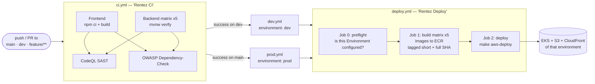
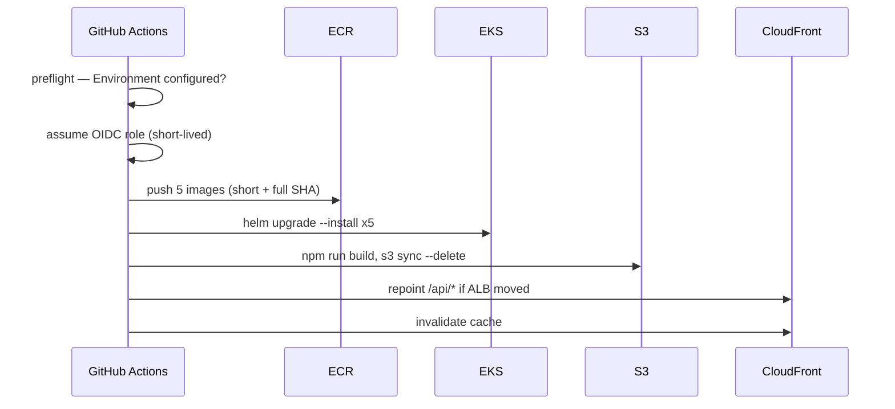

# RentEZ — CI/CD Pipeline Strategy

> Related: [Architecture](architecture.md) · [Branching Strategy](branching-strategy.md) · [AWS Team Setup](aws-team-setup.md)

Five workflows. CI tests everything; on success, a branch workflow calls the
shared deploy workflow, naming the GitHub Environment it should deploy to.



## Workflows

| File | Name | Trigger | Does |
|---|---|---|---|
| `ci.yml` | Rentez CI | push/PR to `main`, `dev`, `feature/**` | Test, SAST, SCA |
| `dev.yml` | Deploy Dev | Rentez CI success on `dev` | Calls `deploy.yml` with `environment: dev` |
| `prod.yml` | Deploy Production | Rentez CI success on `main` | Calls `deploy.yml` with `environment: prod` |
| `deploy.yml` | Rentez Deploy | `workflow_call`, `workflow_dispatch` | Build to ECR, then deploy |
| `sync-main.yml` | Sync Main to Feature Branches | PR merged to `main` | Auto-PR `main` into feature branches |

## Stages

| Stage | What | Blocking |
|---|---|---|
| **Test** | Frontend `npm ci` + `npm run build`; five services `./mvnw verify` (Testcontainers Postgres + Flyway) | Yes |
| **SAST** | CodeQL, `security-extended,security-and-quality`, JS + Java | Yes |
| **SCA** | OWASP Dependency-Check, HTML report artifact | Yes |
| **Preflight** | Does this Environment have `AWS_DEPLOY_ROLE_ARN`? | No — skips the rest |
| **Build** | 5 images → ECR as `rentez-<service>`, `linux/amd64`, GHA layer cache | Yes |
| **Deploy** | `make aws-deploy` — 5 Helm releases, frontend to S3, CloudFront | Yes |

**The frontend test step is currently commented out in `ci.yml`.** Only the
build runs, so a broken component test does not fail CI. Backend tests are
unaffected. Re-enable the `npm test` step when the suite is green.

## Where a run deploys

One AWS account, one role, several targets. The GitHub Environment does not
choose an account — there is only one — it chooses *where inside it* the run
lands, which is what stops a merge to `dev` overwriting a demo off `main`.

| Scope | Variable | Value |
|---|---|---|
| Repository | `AWS_DEPLOY_ROLE_ARN` | the shared CI role — same for every deploy |
| Repository | `AWS_REGION` | `ap-southeast-1` |
| Environment | `CLUSTER_NAME` | `rentez-dev` / `rentez-prod` |
| Environment | `NAMESPACE` | `rentez-dev` / `rentez-prod` |
| Environment | `ENVIRONMENT_STACK` | `rentez-environment-dev` / `-prod` |
| Environment | `ENVIRONMENT_NAME` | `dev` / `prod` |
| Environment | `DB_NAME` | `rentez_dev` / `rentez_prod` |

Variables resolve Environment-first, falling back to the repository, and every
infrastructure name above defaults in `aws/scripts/lib.sh` — so an Environment
that sets none of them deploys to the original single `rentez` environment.
`ACCOUNT_STACK` stays unset: one per account, holding the shared VPC and ECR.

## What a deploy actually does



## Design decisions

- **CI runs the same script a developer runs.** `deploy.yml` calls
  `make aws-deploy`, not a reimplementation in YAML. One description of what
  deploying means, reviewable as shell.
- **Deploy is chained off CI success**, never off a raw push. `workflow_run`
  fires on *completion*, so both callers explicitly check
  `conclusion == 'success'` — without that, a red CI run deploys anyway. That
  guard was missing from `prod.yml` for a while, which is the one place it must
  never be.
- **The configured-or-not check is a job, not a job-level `if`.** A job-level
  `if` is evaluated *before* the job binds its Environment, so it reads only
  repository-level variables and skips every correctly configured run. The
  `preflight` job resolves the variable from inside the Environment and passes a
  boolean out.
- **An unconfigured Environment is green, not red,** and writes "Nothing was
  deployed" to the job summary. A red X on every merge trains the team to ignore
  the workflow; a silent skip left no trace at all, which is how a green run
  that deployed nothing went unnoticed.
- **Build and deploy are separate from provisioning.** The pipeline never runs
  `make aws-up` — that creates hourly-billed resources and takes 20 minutes. A
  human decides when to spend money.
- **OIDC only, no static AWS keys.** Every leg touches AWS, so `GITHUB_TOKEN`
  has no role here and `packages: write` is vestigial. OIDC mints a short-lived
  credential per run with nothing to leak, rotate, or revoke when someone leaves.
  Permissions do not inherit into a called workflow, so `id-token: write` is
  granted in `dev.yml` and `prod.yml`, not just in `deploy.yml`.
- **Images tagged with both short and full SHA.** `make aws-deploy` defaults to
  the 7-char form, so a tag copied from a CI log always works either way.
- **`concurrency: deploy-<environment>`, with `cancel-in-progress: false`.**
  Keyed on the Environment, so a prod deploy no longer queues behind a dev one.
  Two runs against the *same* environment still do, which is the case that
  matters: concurrent Helm rolls interleave and the loser wins. A half-applied
  deploy is worse than a slow one, so queue rather than cancel.
- **`linux/amd64` explicitly.** Nodes are t3/m5 (x86). An arm64 image fails at
  runtime with `exec format error`, which does not mention architecture.

## Expected failure

A deploy run **fails in ~30 seconds when nobody has run `make aws-up`** for that
environment:

```
no cluster 'rentez-dev'. Someone has to run 'make aws-up' first.
```

The environment is leased and self-destructs after four hours, so most merges
outside a working session land with nothing to deploy to. This is correct
behaviour, not a broken pipeline — bring the environment up and re-run the
workflow. Do not "fix" it by removing the check.

`You must be logged in to the server (Unauthorized)` is the other one, and it is
not an IAM problem: the cluster has never been told about the role. Clusters are
ephemeral, so the EKS access entry has to be recreated on every `make aws-up`
with `CI_ROLE_ARN` set.

## Enabling it

`deploy.yml` and its callers stay **dormant** until `vars.AWS_DEPLOY_ROLE_ARN`
is set, so per-member AWS accounts are unaffected. Setup steps are in
[AWS Team Setup](aws-team-setup.md#part-4--enabling-the-pipeline).

Until then, build and deploy by hand:

```bash
make aws-images     # build and push all five images
make aws-deploy     # deploy them
```
