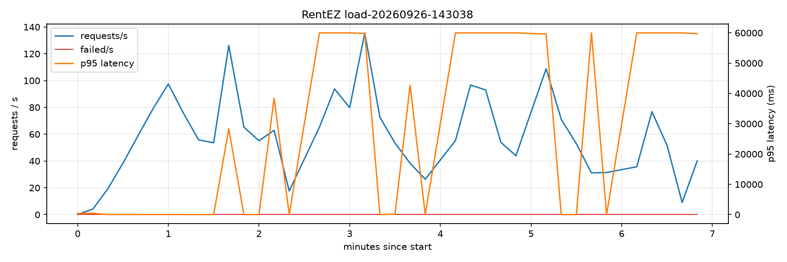
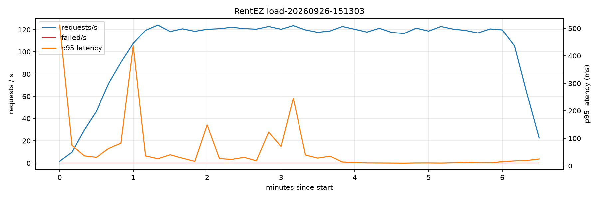
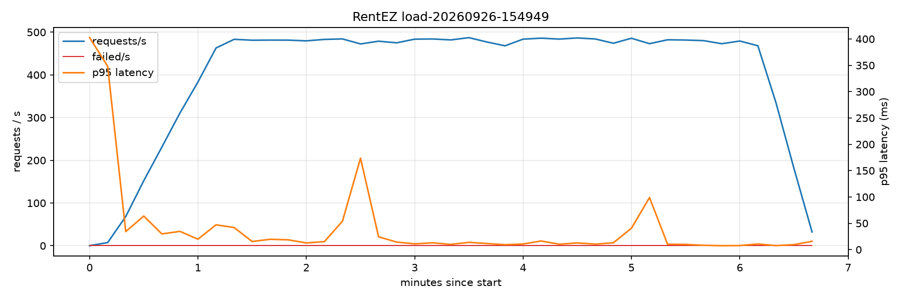

# RentEZ — Demonstrating Performance and Scalability

> Related: [Architecture](architecture.md) · [AWS Team Setup](aws-team-setup.md)

Two quality attributes, each with a scripted test that produces evidence rather
than a claim. All tests are [k6](https://k6.io) scripts in [`perf/`](../perf),
driven through the same public entry point a browser uses.

| Attribute | Question | Test | Evidence |
|---|---|---|---|
| **Performance** | Under expected load, are responses fast enough? | `make perf-load` | k6 thresholds pass/fail, `report.html`, p95/p99 per endpoint |
| **Scalability** | When load exceeds capacity, does the system add capacity by itself and recover? | `make perf-stress TARGET=aws` | `scaling.csv` + `chart.png`: pods and nodes rising with load, latency recovering |
| Elasticity (bonus) | How fast does it react to a sudden jump, and does it give capacity back? | `make perf-spike TARGET=aws` | same chart; scale-up within ~1 min, scale-down after 5 min |

## Setup

```bash
brew install k6
```

```bash
pip install matplotlib
```

## What is being tested

**Traffic mix** ([`perf/lib/flow.js`](../perf/lib/flow.js)), ported from `scripts/smoke.sh`:
70% browse the fleet (`GET /api/catalog/cars`), 20% search availability
(`GET /api/reservations/availability`), 10% book and pay (reservation →
payment → saga back into reservation). A `409` on booking is two virtual users
choosing the same car for overlapping dates — correct behaviour under
contention — so it is not counted as a failure.

**What scales, and how** (already in the deployment, not added for the test):

| Layer | Mechanism | Bounds | Trigger |
|---|---|---|---|
| Pods | HPA per service ([`hpa.yaml`](../deploy/helm/rentez-service/templates/hpa.yaml)) | catalog 2–6, reservation 2–10, account 2–4, payment 2–4 | CPU > 60% of the 200m request; scale-up window 0s, scale-down 300s |
| Nodes | Cluster Autoscaler ([`cluster.yaml`](../aws/eksctl/cluster.yaml)) | 2–5 spot nodes (2 vCPU each) | Pods `Pending` for lack of CPU |

Ten baseline pods at 200m fit on two nodes. At the HPA maximums (26 pods, 5.2
vCPU requested) they do not — so a stress test that drives the HPAs up
**necessarily** exercises the Cluster Autoscaler too.

## Performance test

```bash
SPRING_PROFILES_ACTIVE=seed make up   # or a deployed environment
make perf-smoke                       # must pass first
make perf-load RATE=30                # local; add TARGET=aws for the real thing
```

Constant arrival rate (not constant users), so a slow system keeps getting the
same load instead of quietly receiving less. 1 min warm-up, 5 min measured.

**SLOs** (k6 thresholds; any breach → non-zero exit → FAIL):

| Metric | Target |
|---|---|
| Error rate | < 1% |
| p95 / p99, all requests | < 500 ms / < 1000 ms |
| p95 `catalog_list` | < 300 ms |
| p95 `availability` | < 400 ms |
| p95 `create_booking` | < 800 ms |
| p95 `pay` | < 1000 ms |

To find the capacity limit, repeat with higher `RATE` until a threshold breaks —
the last passing rate is the supported throughput at min replicas.

## Scalability test

```bash
make aws-up                              # ~20 min
make perf-smoke TARGET=aws
make perf-stress TARGET=aws PEAK=300     # ~15 min load + 6 min watching scale-down
make perf-plot                           # chart.png for the newest run
make aws-down
```

`perf/run.sh` starts [`watch-scaling.sh`](../perf/watch-scaling.sh) in the
background, sampling HPA replicas/CPU, ready nodes and pending pods every 15s
into `scaling.csv`, and keeps recording for six minutes after the load ends so
scale-down is on the chart.

`TARGET=aws` goes through CloudFront from your laptop. If your uplink saturates
before the pods do (k6 reports high `http_req_blocked`/`connecting`), use
`TARGET=cluster` — k6 then runs as a Job inside EKS and hits the ALB directly.

### What the chart should show

1. Baseline: 2 pods per service, 2 nodes, low latency.
2. Load rises → CPU crosses 60% → p95 latency climbs → **replicas increase within ~1 min**.
3. Replicas outgrow two nodes → pods `Pending` → **a third node joins in ~3–5 min**.
4. Load still at peak → **latency comes back down**. This is the key point: capacity followed demand.
5. Load stops → replicas stay up for 5 min (deliberate, avoids thrashing), then halve per minute; the extra node goes ~10 min later.

## Live demo (~10 min)

Before the session: run the stress test once and keep `chart.png` and
`report.html` as a backup — spot capacity or a 20-minute `aws-up` is not
something to gamble on in front of an audience.

- Terminal 1: `watch -n5 kubectl get hpa,nodes -n rentez`
- Terminal 2: `make perf-spike TARGET=aws` — k6 prints the live dashboard URL (`http://localhost:5665`), open it
- Narrate: spike hits → CPU column jumps → replica count moves → Pending pods → new node → latency on the dashboard settles.
- Finish on the recorded `chart.png` and the `perf-load` SLO table.

## Results

All local runs: `make clean` first (a fresh database every time), then
`SPRING_PROFILES_ACTIVE=seed make up`, `make perf-smoke`, `make perf-load RATE=<n>`.
One instance of each service, pools of 3 connections, on one MacBook running
both k6 and the stack. Run on 2026-09-26.

**A clean database is not optional.** Every successful booking is CONFIRMED and
never released, and the local fleet is five cars. Early runs booked the fleet
full, after which the booking path silently stopped running and the test
"passed" on reads alone. `perf/lib/flow.js` now spreads dates over ~100 years
and records a `found a free car` check, and `load.js` fails the run if fewer
than 95% of booking attempts find one.

### Performance: before and after

| Rate (actions/s) | Before | After fixes | p95 after | p99 after | Errors after |
|---|---|---|---|---|---|
| 30 | PASS | — | — | — | — |
| 50 | **FAIL** (16% errors, p95 60 s) | PASS | 22 ms | 50 ms | 0% |
| 100 | **FAIL** (15% errors, p95 60 s) | PASS | 31 ms | 164 ms | 0% |
| 150 | **FAIL** | PASS | 17 ms | 163 ms | 0% |
| 200 | **FAIL** | PASS | 13 ms | 35 ms | 0% |
| 300 | **FAIL** | PASS | 50 ms | 613 ms | 0.03% |
| 400 | **FAIL** | **PASS** | **18 ms** | **67 ms** | **0%** |

**Supported throughput went from under 50 to at least 400 actions/s** (418 HTTP
requests/s; roughly 2,000–4,000 concurrent users at a 5–10 s think time), with
no new infrastructure and the same 3-connection pools. 400/s is a floor, not the
ceiling: the next limit has not been found locally. The 300/s run's errors all
fell in one 30 s window 90 s in (15 fast 503s, 27 masked 401s - see below) and
were not repeated at 400/s.





### What load testing found

Every one of these passed all 71 unit and integration tests. None was visible
until the system was under concurrent load.

1. **Nested transactions deadlocked the connection pool.** `AuditService.log`
   was `REQUIRES_NEW`, so every booking, confirmation and payment took a
   *second* connection while its own transaction held the first. With a pool
   of 3, three concurrent bookings each held one and waited for another; nothing
   moved until Hikari's 30 s timeout. The system collapsed at 50 actions/s -
   about 5 bookings/s - with **CPU under 1%**. *Fix:* the audit joins the
   caller's transaction. Every caller audits as the last step of a transaction
   that commits (including the declined-payment path), so no audit row is lost.
2. **Connections were held across HTTP calls.** `BookingService.create` and
   `findAvailable` held a connection through the call to catalog-service, and
   `OutboxDispatcher` held one through the call to notification-service. *Fix:*
   the network call happens with no transaction open.
3. **Overload never drained.** Hikari waited 30 s for a connection and
   service-to-service HTTP had no timeout at all, so every queued request held a
   thread for 30-60 s and the backlog fed itself. *Fix:*
   `hikari.connection-timeout=2000` and `spring.http.clients.{connect,read}-timeout`
   in all five services. Overload now produces fast 503s and recovers.

**Why this matters for scalability:** before these fixes, the CPU-based HPA could
never have helped. The services were blocked, not busy, so more load produced
more timeouts and no CPU for the HPA to see.

## Known limits (report these — they are findings, not failures)

- **CPU is the wrong scaling signal for pool exhaustion.** The fixes make CPU
  rise with load, so the HPA now has something to react to - but if a pool is
  ever exhausted again, the pods sit idle while requests fail. Future work:
  scale reservation on `hikaricp.connections.pending` (already exposed by
  actuator) through KEDA or the Prometheus adapter.
- **account-service and catalog-service still audit with `REQUIRES_NEW`.** They
  were not on the hot path in this test, but they carry the same deadlock.
- **Errors can surface as 401.** An exception forwarded to Spring's `/error`
  page is blocked by Spring Security for anonymous callers, so a public
  endpoint that fails returns 401 instead of its real status. Seen 27 times on
  `/api/catalog/cars` at 300/s. Fix: permit `/error` in each `SecurityConfig`.
- **Pool size versus RDS.** 3 connections per pod is what keeps 25 pods under
  `db.t4g.micro`'s ~112 connections. Raising it needs RDS Proxy (or fewer max
  replicas) - see [ch01](ch01.startup-project.adoc).
- **notification-service does not autoscale.** It is a queue consumer; CPU
  stays low however deep the SQS backlog grows, so a CPU HPA would never fire.
  Future work: KEDA scaling on `ApproximateNumberOfMessagesVisible`.
- **The database is the ceiling.** RDS `db.t4g.micro` does not scale with the
  pods. Past some rate, adding pods adds connections, not throughput — watch
  RDS CPU/connections in CloudWatch during the stress test to locate it. At
  400/s locally, Postgres was already the busiest container (37% CPU).
- **Scale-down is slow on purpose** (300s window), trading a few minutes of
  idle pods for not thrashing spot nodes.
- **Local runs measure performance only.** Docker Compose has no autoscaler;
  scalability is only demonstrable on EKS. The AWS stress test has not been
  run yet.
