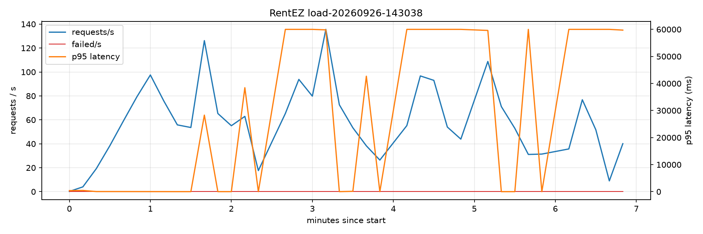
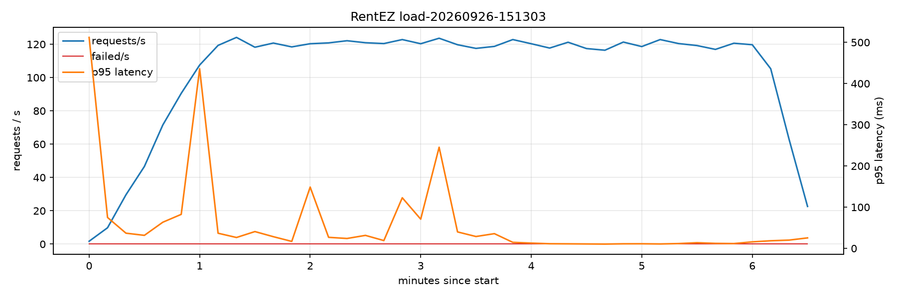
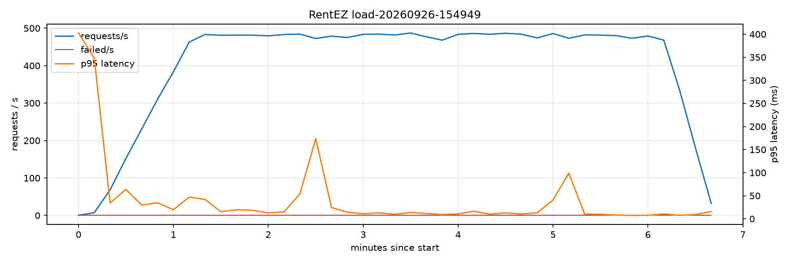
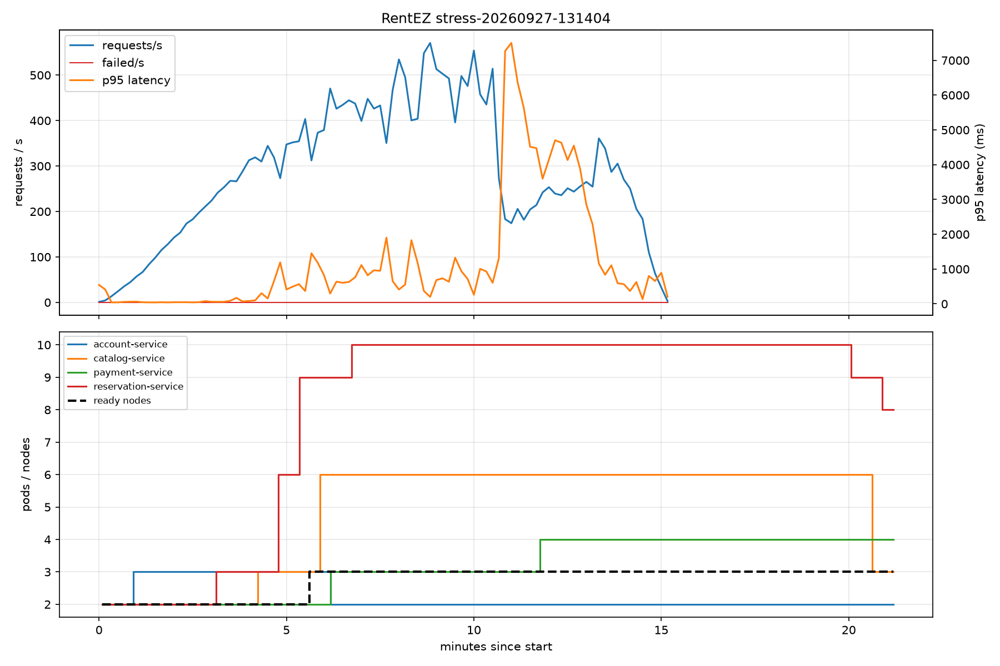
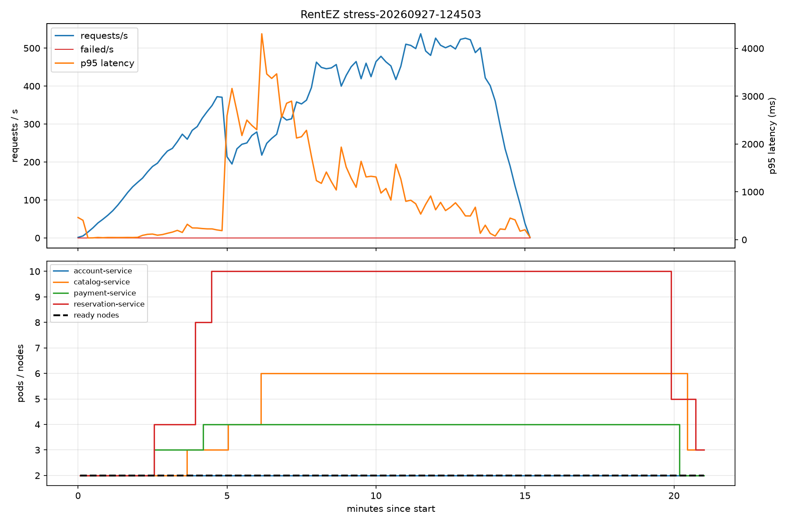
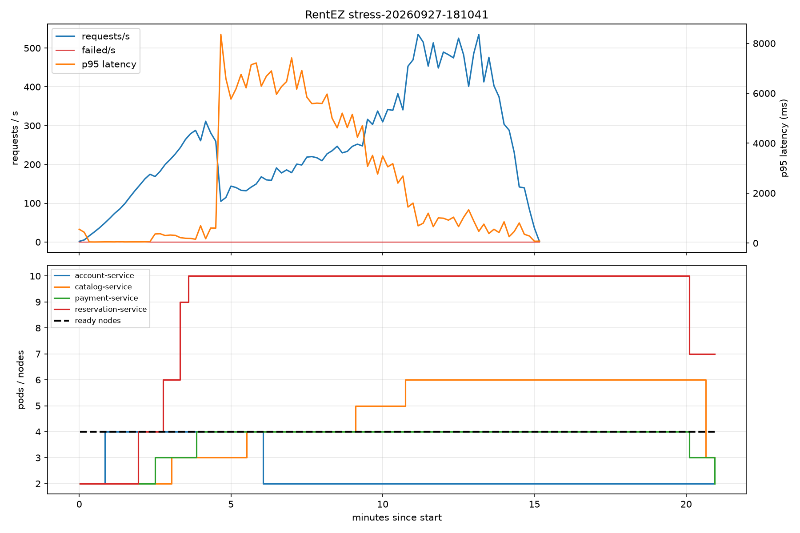

# RentEZ — Demonstrating Performance and Scalability

> Related: [Architecture](architecture.md) · [AWS Team Setup](aws-team-setup.md)

Two quality attributes, each with a scripted test that produces evidence rather
than a claim. All tests are [k6](https://k6.io) scripts in [`perf/`](../perf),
driven through the same public entry point a browser uses.

| Attribute | Question | Test | Evidence |
|---|---|---|---|
| **Performance** | Under expected load, are responses fast enough? | `make perf-load` | k6 thresholds pass/fail, `report.html`, p95/p99 per endpoint |
| **Scalability** | When load exceeds capacity, does the system add capacity by itself and recover? | `make perf-stress TARGET=aws` | `scaling.csv` + `chart.png`: pods and nodes rising with load, latency recovering |
| Elasticity (bonus) | How fast does it react to a sudden jump, and does it give capacity back? | `make perf-spike TARGET=aws` | same chart; scale-up within ~1 min, scale-down after 5 min |

## Setup

```bash
brew install k6
```

```bash
pip install matplotlib
```

## What is being tested

**Traffic mix** ([`perf/lib/flow.js`](../perf/lib/flow.js)), ported from `scripts/smoke.sh`:
70% browse the fleet (`GET /api/catalog/cars`), 20% search availability
(`GET /api/reservations/availability`), 10% book and pay (reservation →
payment → saga back into reservation). A `409` on booking is two virtual users
choosing the same car for overlapping dates — correct behaviour under
contention — so it is not counted as a failure.

**What scales, and how** (already in the deployment, not added for the test):

| Layer | Mechanism | Bounds | Trigger |
|---|---|---|---|
| Pods | HPA per service ([`hpa.yaml`](../deploy/helm/rentez-service/templates/hpa.yaml)) | catalog 3–6, reservation 2–10, account 2–4, payment 2–4 | CPU > 60% of the 200m request; scale-up window 0s, scale-down 300s |
| Nodes | Cluster Autoscaler ([`cluster.yaml`](../aws/eksctl/cluster.yaml)) | 2–5 spot nodes (2 vCPU each) | Pods `Pending` for lack of CPU |

Ten baseline pods at 200m fit on two nodes. At the HPA maximums (26 pods, 5.2
vCPU requested) they do not — so a stress test that drives the HPAs up
**necessarily** exercises the Cluster Autoscaler too.

## Performance test

```bash
SPRING_PROFILES_ACTIVE=seed make up   # or a deployed environment
make perf-smoke                       # must pass first
make perf-load RATE=30                # local; add TARGET=aws for the real thing
```

Constant arrival rate (not constant users), so a slow system keeps getting the
same load instead of quietly receiving less. 1 min warm-up, 5 min measured.

**SLOs** (k6 thresholds; any breach → non-zero exit → FAIL):

| Metric | Target |
|---|---|
| Error rate | < 1% |
| p95 / p99, all requests | < 500 ms / < 1000 ms |
| p95 `catalog_list` | < 300 ms |
| p95 `availability` | < 400 ms |
| p95 `create_booking` | < 800 ms |
| p95 `pay` | < 1000 ms |

To find the capacity limit, repeat with higher `RATE` until a threshold breaks —
the last passing rate is the supported throughput at min replicas.

## Scalability test

```bash
make aws-up                              # ~20 min
make perf-smoke TARGET=aws
make perf-stress TARGET=aws PEAK=300     # ~15 min load + 6 min watching scale-down
make perf-plot                           # chart.png for the newest run
make aws-down
```

`perf/run.sh` starts [`watch-scaling.sh`](../perf/watch-scaling.sh) in the
background, sampling HPA replicas/CPU, ready nodes and pending pods every 15s
into `scaling.csv`, and keeps recording for six minutes after the load ends so
scale-down is on the chart.

`TARGET=aws` goes through CloudFront from your laptop. If your uplink saturates
before the pods do (k6 reports high `http_req_blocked`/`connecting`), use
`TARGET=cluster` — k6 then runs as a Job inside EKS and hits the ALB directly.

### What the chart should show

1. Baseline: 2 pods per service, 2 nodes, low latency.
2. Load rises → CPU crosses 60% → p95 latency climbs → **replicas increase within ~1 min**.
3. Replicas outgrow two nodes → pods `Pending` → **a third node joins in ~3–5 min**.
4. Load still at peak → **latency comes back down**. This is the key point: capacity followed demand.
5. Load stops → replicas stay up for 5 min (deliberate, avoids thrashing), then halve per minute; the extra node goes ~10 min later.

## Live demo (~10 min)

Before the session: run the stress test once and keep `chart.png` and
`report.html` as a backup — spot capacity or a 20-minute `aws-up` is not
something to gamble on in front of an audience.

- Terminal 1: `watch -n5 kubectl get hpa,nodes -n rentez`
- Terminal 2: `make perf-spike TARGET=aws` — k6 prints the live dashboard URL (`http://localhost:5665`), open it
- Narrate: spike hits → CPU column jumps → replica count moves → Pending pods → new node → latency on the dashboard settles.
- Finish on the recorded `chart.png` and the `perf-load` SLO table.

## Results

All local runs: `make clean` first (a fresh database every time), then
`SPRING_PROFILES_ACTIVE=seed make up`, `make perf-smoke`, `make perf-load RATE=<n>`.
One instance of each service, pools of 3 connections, on one MacBook running
both k6 and the stack. Run on 2026-09-26.

**A clean database is not optional.** Every successful booking is CONFIRMED and
never released, and the local fleet is five cars. Early runs booked the fleet
full, after which the booking path silently stopped running and the test
"passed" on reads alone. `perf/lib/flow.js` now spreads dates over ~100 years
and records a `found a free car` check, and `load.js` fails the run if fewer
than 95% of booking attempts find one.

### Performance: before and after

| Rate (actions/s) | Before | After fixes | p95 after | p99 after | Errors after |
|---|---|---|---|---|---|
| 30 | PASS | — | — | — | — |
| 50 | **FAIL** (16% errors, p95 60 s) | PASS | 22 ms | 50 ms | 0% |
| 100 | **FAIL** (15% errors, p95 60 s) | PASS | 31 ms | 164 ms | 0% |
| 150 | **FAIL** | PASS | 17 ms | 163 ms | 0% |
| 200 | **FAIL** | PASS | 13 ms | 35 ms | 0% |
| 300 | **FAIL** | PASS | 50 ms | 613 ms | 0.03% |
| 400 | **FAIL** | **PASS** | **18 ms** | **67 ms** | **0%** |

**Supported throughput went from under 50 to at least 400 actions/s** (418 HTTP
requests/s; roughly 2,000–4,000 concurrent users at a 5–10 s think time), with
no new infrastructure and the same 3-connection pools. 400/s is a floor, not the
ceiling: the next limit has not been found locally. The 300/s run's errors all
fell in one 30 s window 90 s in (15 fast 503s, 27 masked 401s - see below) and
were not repeated at 400/s.





### What load testing found

Every one of these passed all 71 unit and integration tests. None was visible
until the system was under concurrent load.

1. **Nested transactions deadlocked the connection pool.** `AuditService.log`
   was `REQUIRES_NEW`, so every booking, confirmation and payment took a
   *second* connection while its own transaction held the first. With a pool
   of 3, three concurrent bookings each held one and waited for another; nothing
   moved until Hikari's 30 s timeout. The system collapsed at 50 actions/s -
   about 5 bookings/s - with **CPU under 1%**. *Fix:* the audit joins the
   caller's transaction. Every caller audits as the last step of a transaction
   that commits (including the declined-payment path), so no audit row is lost.
2. **Connections were held across HTTP calls.** `BookingService.create` and
   `findAvailable` held a connection through the call to catalog-service, and
   `OutboxDispatcher` held one through the call to notification-service. *Fix:*
   the network call happens with no transaction open.
3. **Overload never drained.** Hikari waited 30 s for a connection and
   service-to-service HTTP had no timeout at all, so every queued request held a
   thread for 30-60 s and the backlog fed itself. *Fix:*
   `hikari.connection-timeout=2000` and `spring.http.clients.{connect,read}-timeout`
   in all five services. Overload now produces fast 503s and recovers.

4. **Errors surfaced as 401.** Spring re-dispatches an unhandled exception to
   `/error`; Spring Security treated that as an anonymous request to a
   protected path, so every failure on a public endpoint returned 401 - 27
   times locally at 300/s, ~2,500 in the first AWS stress test and ~11,000 in
   the dev one, hiding nearly all the real errors. *Fix:*
   `dispatcherTypeMatchers(DispatcherType.ERROR).permitAll()` in all five
   `SecurityConfig`s. Verified by stopping Postgres locally: the car list now
   returns 500 and availability 503.
5. **The same audit deadlock in account and catalog.** Not on the hot path
   yet, but carrying the pattern from 1. *Fix:* the same - the audit joins the
   caller's transaction; every caller audits only on success.

**Why this matters for scalability:** before these fixes, the CPU-based HPA could
never have helped. The services were blocked, not busy, so more load produced
more timeouts and no CPU for the HPA to see.

### On AWS: performance and scalability

Run on 2026-09-27 against the dev environment (`7cfb12b`, the merged fixes):
EKS 1.31 on two spot t3/m5.large nodes, one `db.t4g.micro` RDS instance, all
traffic from a laptop through CloudFront. HPA and node counts recorded every
15 s by `watch-scaling.sh`.

| Test | Load | p95 | p99 | Errors | Most pods (res / cat / pay / acc) | Nodes |
|---|---|---|---|---|---|---|
| smoke | 1 user | 83 ms | — | 0% | 2 / 2 / 2 / 2 | 2 |
| load | 50/s | 150 ms | 371 ms | 0% | 7 / 5 / 4 / 3 | 2 |
| load | 100/s | **56 ms** | **97 ms** | **0%** | 9 / 5 / 4 / 4 | 2 |
| stress, before CA fix | ramp to 300 users, ~317 req/s | 1.24 s | — | 1.16% | 10 / 6 / 4 / 2 | **2 (8 pods Pending ~15 min)** |
| stress, after CA fix | ramp to 300 users, ~290 req/s | 1.02 s | — | 0.99% | 10 / 6 / 4 / 3 | **2 → 3** |

The 50/s run was slower than the 100/s one because it paid for the scale-up
inside its measured window; 100/s started with pods already scaled.

**What the stress test shows, after the fix:** load rises, reservation's CPU
crosses 60% of its request at minute 3, the HPA takes it from 2 to 10 pods by
minute 6, three pods cannot be placed, the Cluster Autoscaler adds a third node
at minute 5 and the Pending pods clear within a minute. Per-pod CPU then falls
from ~200% to ~60% while load is still at peak. When load stops, replicas hold
for the 300 s window and then shrink.



**What it found first:** the Cluster Autoscaler had never worked. `aws-up.sh`
installed the chart without an image tag, so it ran v1.35.0 against a 1.31
control plane. It watched APIs 1.31 does not serve (`ResourceSlice`,
`ResourceClaim`, `DeviceClass`), its informers never synced, and its main loop
never ran - it logged nothing but those watch errors while 8 pods sat Pending
for 15 minutes on 2 nodes of a 5-node group. The image is now pinned to
v1.31.5, and `aws-up` refuses to install a version whose minor differs from the
cluster's.



**The remaining ~1% of errors** fell at peak load after scaling had finished,
with reservation and catalog both at their HPA maximums (10 and 6) and catalog
still at ~150% of its CPU request - the ceiling the HPA bounds allow, not a
failure to scale. ~96% of them were masked 401s (see "Errors surfaced as 401"
below - now fixed).

### On AWS dev, as a separate environment

Rerun on 2026-09-27 against `rentez-dev` (`f9a8ebe`, all of the above merged),
its own cluster, namespace and database, through its own CloudFront URL.

| Test | Load | p95 | p99 | Errors | Result |
|---|---|---|---|---|---|
| smoke | end-to-end booking flow | — | — | 0 (33/33 checks) | PASS |
| load | 50/s | 191 ms | 424 ms | 0% | PASS |
| load | 100/s | **86 ms** | **216 ms** | **0%** | PASS |
| stress | ramp to 300 users, ~249 req/s | 2.66 s | — | **4.86%** | PASS (limit 5%) |

The load results match the morning's. The stress run did not, and it is the
clearest evidence yet for the first known limit below:

- Reservation scaled 2 → 10 within four minutes, as before. Nodes did not need
  to: the cluster still had 4 from the load tests (the Cluster Autoscaler waits
  ~10 minutes to remove one), so no pod was ever Pending.
- **Catalog was the failure.** 10,885 of the 11,013 errors were on
  `/api/catalog/cars`, between minutes 4 and 10. Catalog sat at **3–4 pods with
  CPU at only 70–90%** of its request - over the 60% target, but not by enough
  to scale quickly - while its 3-connection pools ran dry. It reached its
  maximum of 6 at minute 11. With the 2 s fail-fast timeout that shows as
  errors, not latency.



**Changed after this run:** catalog's `minReplicas` 2 → 3 (9 connections before
the HPA has to react; the maximum and the RDS budget are unchanged), and the
401 masking fixed so the next run reports the real status.

## Known limits (report these — they are findings, not failures)

- **CPU is the wrong scaling signal for pool exhaustion.** Demonstrated by
  catalog in the AWS dev stress test: pools dry, CPU only 70-90%, scaling late.
  Raising catalog's minimum to 3 buys headroom; the fix is to scale on
  `hikaricp.connections.pending` (already exposed by actuator) through KEDA or
  the Prometheus adapter.
- **Pool size versus RDS - now shared by two environments.** 3 connections per
  pod keeps one environment's 25 max pods at 75, under `db.t4g.micro`'s ~112.
  Dev and prod share that instance, so **both at full scale-out would want
  150** and exhaust it. Fine while only one runs at a time; running both under
  load needs RDS Proxy, a larger instance class, or lower HPA maximums - see
  [ch01](ch01.startup-project.adoc).
- **notification-service does not autoscale.** It is a queue consumer; CPU
  stays low however deep the SQS backlog grows, so a CPU HPA would never fire.
  Future work: KEDA scaling on `ApproximateNumberOfMessagesVisible`.
- **The database is the ceiling.** RDS `db.t4g.micro` does not scale with the
  pods. Past some rate, adding pods adds connections, not throughput — watch
  RDS CPU/connections in CloudWatch during the stress test to locate it. At
  400/s locally, Postgres was already the busiest container (37% CPU).
- **Scale-down is slow on purpose** (300s window), trading a few minutes of
  idle pods for not thrashing spot nodes.
- **Local runs measure performance only.** Docker Compose has no autoscaler;
  scalability is only demonstrable on EKS.
- **HPA maximums cap peak throughput.** At 300 users reservation (10) and
  catalog (6) sat at their maximums with the third node half-empty. Raising
  those bounds, within the RDS connection budget, is the next lever.
